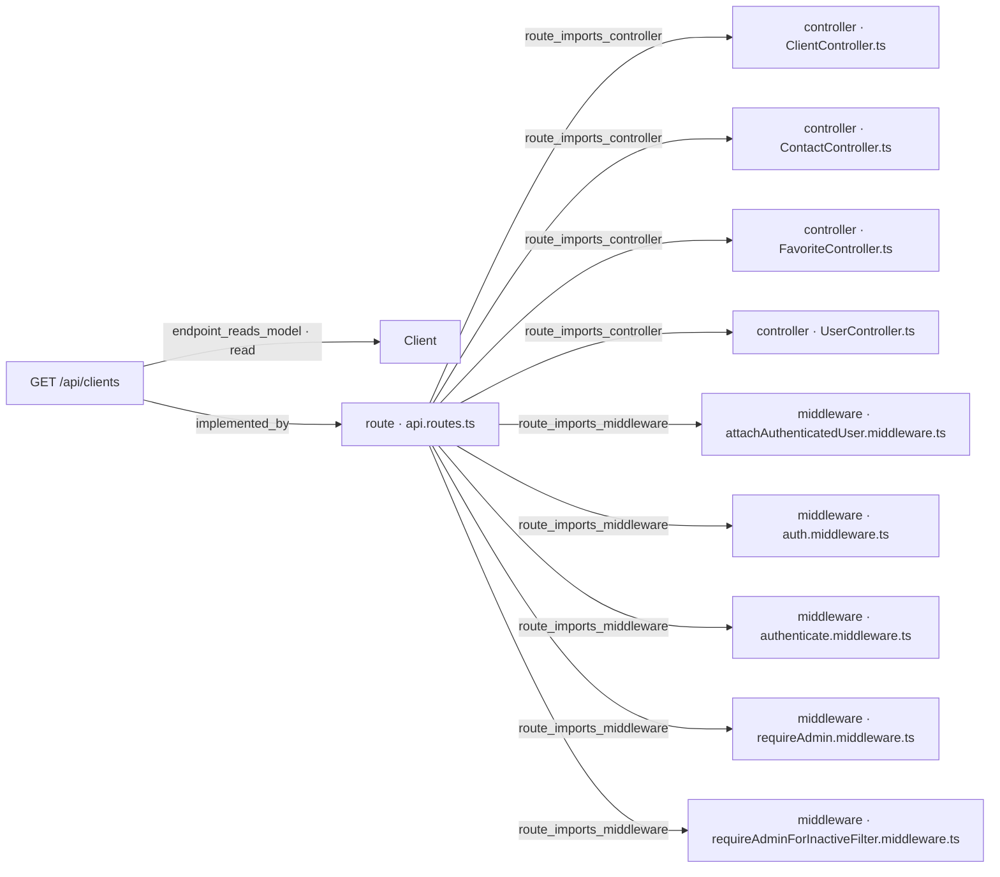

# [Documentation] Clients — Búsqueda de clientes por nombre

## Qué hace

Este work item documenta la extensión del endpoint [ancla:endpoint GET /api/clients] que permite filtrar el listado de clientes por nombre mediante un parámetro de búsqueda textual [ancla:user_story HU-001].

Antes de esta funcionalidad, localizar un cliente concreto exigía recorrer el listado página a página en el frontend. Con el parámetro `search`, el endpoint devuelve únicamente los clientes cuyo nombre contiene el texto indicado, sin distinguir mayúsculas ni minúsculas [spec:acceptance_criteria AC-01]. Cuando `search` está ausente, el comportamiento del listado no cambia en absoluto [spec:acceptance_criteria AC-05].

La operación es exclusivamente de lectura: no crea ni modifica ningún dato [arista:GET /api/clients→Client].

---

## Cómo está construido

El endpoint [ancla:endpoint GET /api/clients] está declarado en `api.routes.ts` [arista:GET /api/clients→route · api.routes.ts], que importa y compone los middlewares y controladores necesarios.

**Middlewares en la cadena de la ruta**

La ruta registra cinco middlewares [arista:route · api.routes.ts→middleware · attachAuthenticatedUser.middleware.ts] [arista:route · api.routes.ts→middleware · auth.middleware.ts] [arista:route · api.routes.ts→middleware · authenticate.middleware.ts] [arista:route · api.routes.ts→middleware · requireAdmin.middleware.ts] [arista:route · api.routes.ts→middleware · requireAdminForInactiveFilter.middleware.ts]:

| Middleware | Responsabilidad relevante para la búsqueda |
|---|---|
| `authenticate.middleware.ts` | Verifica que el solicitante está autenticado. |
| `attachAuthenticatedUser.middleware.ts` | Adjunta el usuario autenticado al contexto de la petición. |
| `auth.middleware.ts` | El doc-pack no incluye información sobre la responsabilidad específica de este middleware más allá de su participación en la ruta. |
| `requireAdmin.middleware.ts` | El doc-pack no incluye información sobre cuándo se activa este middleware en el flujo concreto de esta ruta. |
| `requireAdminForInactiveFilter.middleware.ts` | Intercepta las peticiones con `status=inactive` realizadas por usuarios no administradores y responde con `403` antes de que el validador evalúe el resto de parámetros, incluido `search` [spec:business_rule RN-03]. |

**Controlador**

La lógica de la ruta delega en `ClientController.ts` [arista:route · api.routes.ts→controller · ClientController.ts]. Los demás controladores importados por `api.routes.ts` — `ContactController.ts`, `FavoriteController.ts` y `UserController.ts` [arista:route · api.routes.ts→controller · ContactController.ts] [arista:route · api.routes.ts→controller · FavoriteController.ts] [arista:route · api.routes.ts→controller · UserController.ts] — sirven otras rutas del mismo fichero y no intervienen en [ancla:endpoint GET /api/clients].

La implementación de backend, incluyendo los tests, se recoge en [wi:WI-API-CLIENTE-BUSQUEDA-001].

---

## Reglas de negocio

### RN-01 · La búsqueda es un literal, con distinción de acentos

El texto recibido en `search` se trata como una cadena literal: los caracteres con significado especial en expresiones regulares (`. * + ? ^ $ { } ( ) | [ ] \`) se escapan antes de ejecutar la consulta, por lo que buscar `.*` devuelve únicamente los clientes cuyo nombre contiene esos dos caracteres, no todos los clientes [spec:business_rule RN-01] [spec:acceptance_criteria AC-02].

La búsqueda es insensible a mayúsculas pero **sí distingue acentos**: `Jose` no encuentra a `José`. Normalizar acentos requeriría collation o normalización explícita y queda fuera del alcance de esta spec [spec:business_rule RN-01].

### RN-02 · Longitud mínima y máxima del parámetro

El parámetro `search`, tras eliminar los espacios de los extremos, debe tener entre **2 y 100 caracteres**. Cualquier valor fuera de ese rango —incluyendo una cadena formada únicamente por espacios, que queda vacía tras el trim— produce una respuesta `400 Bad Request`. No se interpreta como una búsqueda vacía que devuelva todos los clientes [spec:business_rule RN-02] [spec:acceptance_criteria AC-03].

### RN-03 · La búsqueda no altera el control de acceso por estado

El parámetro `search` se combina con el filtro `status` existente y no modifica quién puede ver clientes inactivos. El middleware `requireAdminForInactiveFilter` se ejecuta antes que la validación de `search` [arista:route · api.routes.ts→middleware · requireAdminForInactiveFilter.middleware.ts]; por tanto:

- Un **usuario no administrador** que envíe `status=inactive` recibe `403`, incluso si `search` también fuera inválido.
- Un **administrador** sí queda sujeto a la validación: `search=a&status=inactive` produce `400` porque `a` tiene solo un carácter [spec:business_rule RN-03] [spec:acceptance_criteria AC-04].

### RN-04 · La búsqueda solo opera sobre el nombre; el email permanece opaco

La búsqueda se limita al campo `name`. El campo `email` se ofusca en todas las respuestas mediante `toPublicClient` → `obfuscateValue`. Permitir buscar por email convertiría la búsqueda en un oráculo que revelaría el contenido del campo carácter a carácter [spec:business_rule RN-04] [spec:acceptance_criteria AC-07].

### Comportamiento adicional del listado con búsqueda activa

- Si ningún cliente coincide con el texto buscado, el endpoint responde con una lista vacía y `total: 0`; no es un error [spec:acceptance_criteria AC-06].
- El total paginado y los conteos reflejan exclusivamente los registros que cumplen el filtro, no el total global de clientes [spec:acceptance_criteria AC-08].

---

## Cómo verificarlo

| Escenario | Parámetros de ejemplo | Respuesta esperada |
|---|---|---|
| Búsqueda insensible a mayúsculas | `search=garcia` | Incluye clientes con «Garcia», «GARCIA», «García» (este último, **solo si el acento coincide**) [spec:acceptance_criteria AC-01] |
| Búsqueda literal de caracteres especiales | `search=.*` | Solo clientes cuyo nombre contiene `.*` literalmente [spec:acceptance_criteria AC-02] |
| Texto demasiado corto (1 carácter) | `search=a` | `400 Bad Request` [spec:acceptance_criteria AC-03] |
| Texto solo espacios | `search=   ` | `400 Bad Request` [spec:acceptance_criteria AC-03] |
| No administrador con `status=inactive` | `search=lopez&status=inactive` | `403 Forbidden`, independientemente de la validez de `search` [spec:acceptance_criteria AC-04] |
| Sin parámetro `search` | _(sin search)_ | Listado idéntico al comportamiento previo [spec:acceptance_criteria AC-05] |
| Sin coincidencias | `search=zzznombreimposible` | `200 OK` con lista vacía y `total: 0` [spec:acceptance_criteria AC-06] |
| Paginación con búsqueda | `search=martin&page=2` | `total` refleja solo los clientes que coinciden con `martin` [spec:acceptance_criteria AC-08] |

---

## Notas para el mantenedor

**Orden de middlewares es crítico.** `requireAdminForInactiveFilter` debe ejecutarse antes del validador de `search` para garantizar que un usuario no administrador reciba `403` y no `400` cuando envía `status=inactive` con un `search` inválido simultáneamente [spec:business_rule RN-03] [arista:route · api.routes.ts→middleware · requireAdminForInactiveFilter.middleware.ts]. Reordenar los middlewares en `api.routes.ts` puede invertir la precedencia de errores y romper [spec:acceptance_criteria AC-04].

**Escape de caracteres especiales en la expresión regular.** La implementación escapa el valor de `search` antes de construir cualquier patrón de búsqueda. Si se modifica esa lógica, debe verificarse que caracteres como `.`, `*`, `(` y `\` siguen siendo tratados como literales [spec:business_rule RN-01] [spec:acceptance_criteria AC-02].

**Acentos y collation.** La búsqueda distingue acentos de forma deliberada. Hacerla insensible a acentos requeriría cambios en la collation de la base de datos o una normalización explícita del texto antes de la consulta, y está fuera del alcance de esta spec [spec:business_rule RN-01].

**El email nunca debe añadirse como campo de búsqueda.** La ofuscación de `email` en la respuesta y la exclusión de ese campo del filtro son decisiones de privacidad coordinadas. Añadir `email` como campo de búsqueda, aunque fuera parcial, violaría [spec:business_rule RN-04] y [spec:acceptance_criteria AC-07].

**Implementación y tests.** La implementación de backend completa, incluyendo su suite de tests, forma parte de [wi:WI-API-CLIENTE-BUSQUEDA-001]. Cualquier cambio en las reglas de negocio documentadas aquí debe reflejarse también en los tests de ese work item.