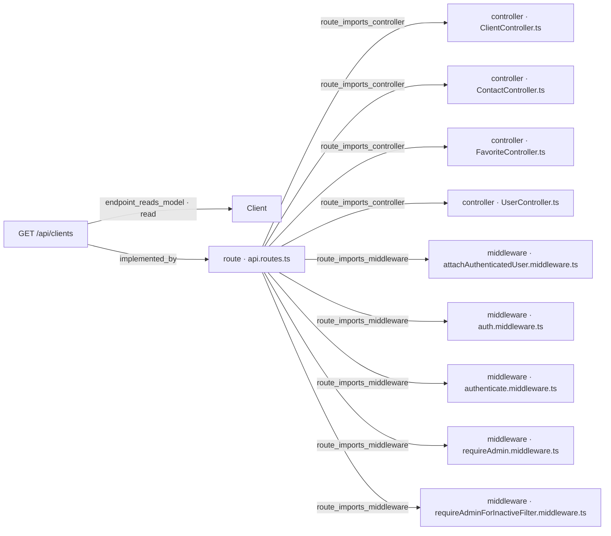

# [Documentation] Clients — Búsqueda de clientes por nombre

## Qué pide la spec

La spec [ancla:user_story HU-001] resuelve un problema de usabilidad del frontend: para localizar a un cliente concreto, el usuario debe recorrer el listado página a página. La solución es añadir un parámetro opcional `search` al endpoint existente [spec:endpoint GET /api/clients] que filtre el resultado a los clientes cuyo nombre contiene el texto introducido, sin distinguir mayúsculas. No se crea ninguna ruta nueva —`/api/clients/search` chocaría con `/api/clients/:id`— y cuando `search` está ausente el listado se comporta exactamente igual que antes [spec:acceptance_criteria AC-05].

El diseño está guiado por dos restricciones que definen qué se busca y cómo:

- **Solo el nombre.** El email sale ofuscado en todas las respuestas mediante `toPublicClient` y buscarlo funcionaría como un oráculo para desvelarlo carácter a carácter [spec:business_rule RN-04]. Por eso el filtro Mongo aplica exclusivamente sobre el campo `name` [spec:acceptance_criteria AC-07].
- **Texto literal, escapado.** El valor que el usuario escribe nunca llega a Mongo como expresión regular directa: todos los metacaracteres de regex (`. * + ? ^ $ { } ( ) | [ ] \`) se escapan antes de construir el `RegExp` [spec:business_rule RN-01], de forma que buscar `.*` devuelve solo los clientes cuyo nombre contiene literalmente esos dos caracteres [spec:acceptance_criteria AC-02].

La validación del parámetro se realiza en el validador `validateListClients` con `.trim()` antes de medir la longitud: `search` debe tener entre 2 y 100 caracteres una vez eliminados los espacios del extremo; fuera de ese rango —incluido un valor formado solo por espacios— la respuesta es un 400 [spec:business_rule RN-02] [spec:acceptance_criteria AC-03] [spec:error VALIDATION_ERROR].

La barrera de autorización no cambia: el middleware `requireAdminForInactiveFilter` precede al validador en la cadena, de modo que un no administrador que solicita `status=inactive` recibe un 403 [spec:error CLIENTS_FORBIDDEN_FILTER] incluso si `search` también sería inválido [spec:business_rule RN-03] [spec:acceptance_criteria AC-04]. Cuando no hay coincidencias la respuesta es 200 con `items: []` y `total: 0`, no un error [spec:acceptance_criteria AC-06]. La paginación y el total cuentan únicamente los documentos que coinciden con el filtro [spec:acceptance_criteria AC-08].

## El trabajo y su historia

| work item | tipo | estado | asignado a |
|---|---|---|---|
| WI-API-CLIENTE-BUSQUEDA-001 | Backend | Mergeado | Jorge Developer |
| WI-API-CLIENTE-BUSQUEDA-002 | Documentación | Asignado | Jorge Developer |

| fecha y hora (UTC) | work item | qué pasó | quién | motivo |
|---|---|---|---|---|
| 2026-09-30 03:36 | WI-API-CLIENTE-BUSQUEDA-001 | nace en «Generado» | Administrador Global | nacimiento del work item |
| 2026-09-30 03:36 | WI-API-CLIENTE-BUSQUEDA-002 | nace en «Generado» | Administrador Global | nacimiento del work item |
| 2026-09-30 03:37 | WI-API-CLIENTE-BUSQUEDA-001 | «Generado» → «Contexto Listo» | Administrador Global | context pack preparado |
| 2026-09-30 03:38 | WI-API-CLIENTE-BUSQUEDA-001 | «Contexto Listo» → «Aprobado» | Administrador Global | — |
| 2026-09-30 03:38 | WI-API-CLIENTE-BUSQUEDA-001 | «Aprobado» → «Asignado» | Administrador Global | asignación de work item |
| 2026-09-30 03:39 | WI-API-CLIENTE-BUSQUEDA-001 | «Asignado» → «En Progreso» | Administrador Global | Run autónomo 1dc25e3c-74bd-4ec4-b4a3-16681404508c (agente developer) |
| 2026-09-30 03:53 | WI-API-CLIENTE-BUSQUEDA-001 | PR #18 abierto | git | WI-API-CLIENTE-BUSQUEDA-001 · implementación autónoma |
| 2026-09-30 03:53 | WI-API-CLIENTE-BUSQUEDA-001 | «En Progreso» → «MR Abierto · en revisión» | sin actor registrado | automático: pull request #18 en feature/MEAN-API-CLIENTE-BUSQUEDA-001/WP-API-CLIENTE-BUSQUEDA-001 |
| 2026-09-30 11:55 | WI-API-CLIENTE-BUSQUEDA-002 | «Generado» → «Contexto Listo» | Administrador Global | context pack preparado |
| 2026-10-01 14:34 | WI-API-CLIENTE-BUSQUEDA-002 | «Contexto Listo» → «Aprobado» | Administrador Global | — |
| 2026-10-01 14:34 | WI-API-CLIENTE-BUSQUEDA-002 | «Aprobado» → «Asignado» | Administrador Global | asignación de work item |
| 2026-10-01 21:08 | WI-API-CLIENTE-BUSQUEDA-001 | PR #18 mergeado | git | WI-API-CLIENTE-BUSQUEDA-001 · implementación autónoma |
| 2026-10-04 01:45 | WI-API-CLIENTE-BUSQUEDA-001 | «MR Abierto · en revisión» → «Validado» | Administrador Global | — |
| 2026-10-04 01:45 | WI-API-CLIENTE-BUSQUEDA-001 | «Validado» → «Mergeado» | Administrador Global | — |

La spec se dividió en dos work items: la implementación backend [wi:WI-API-CLIENTE-BUSQUEDA-001] y este documento de API. Ambos nacieron simultáneamente el 2026-09-30 a las 03:36 UTC [estado:WI-API-CLIENTE-BUSQUEDA-001] [estado:WI-API-CLIENTE-BUSQUEDA-002].

El work item de backend recorrió su ciclo completo en poco más de cuatro días: pasó a «Contexto Listo» un minuto después de nacer, fue aprobado y asignado a las 03:38, y el agente developer lo llevó a «En Progreso» a las 03:39 [estado:WI-API-CLIENTE-BUSQUEDA-001]. El PR #18 se abrió a las 03:53 del mismo día [git:PR #18] y quedó en revisión de forma automática. Mergeó el 2026-10-01 a las 21:08 UTC y fue validado y cerrado formalmente el 2026-10-04 a las 01:45 UTC [estado:WI-API-CLIENTE-BUSQUEDA-001].

Este work item de documentación recibió su context pack más de ocho horas después del nacimiento (2026-09-30 11:55 UTC) y fue aprobado y asignado el 2026-10-01 a las 14:34 UTC, antes de que el PR de backend mergeara [estado:WI-API-CLIENTE-BUSQUEDA-002]. La cronología no registra ningún estado intermedio entre «Asignado» y el momento de redacción de este documento, lo que constituye un hueco en el historial de WI-API-CLIENTE-BUSQUEDA-002.

## Lo que se tocó

### WI-API-CLIENTE-BUSQUEDA-001 · Backend · «Mergeado»
- Informe de finalización [informe:WI-API-CLIENTE-BUSQUEDA-001], 2026-10-01 21:08 UTC, commit 0668a02: 8 de 8 criterios cubiertos.
  - Lo que dijo al entregarlo: Implementados todos los criterios de HU-001: búsqueda por nombre en GET /api/clients mediante el parámetro opcional search (2-100 chars tras trim), con escape de caracteres regex (RN-01), validación en validateListClients (RN-02), conservación de la barrera 403 para no-admins antes de la validación (RN-03) y búsqueda exclusivamente en el campo name (RN-04). Tests unitarios de escapeRegex y ClientService.list con search en ClientService.test.ts; tests de integración de todos los ACs en clients.integration.test.ts. 133 tests en verde.
  - Pruebas ejecutadas: `api/src/services/ClientService.test.ts` (pass), `api/src/__tests__/clients.integration.test.ts` (pass), `api/src/__tests__/client-count.integration.test.ts` (pass), `api/src/__tests__/favorites.integration.test.ts` (pass), `api/src/services/FavoriteService.test.ts` (pass), `api/src/lib/obfuscate.test.ts` (pass)
  - Criterios y sus pruebas:
    - AC-01 (cubierto): Test de integración 'AC-01 — returns active clients whose name contains the search term (case-insensitive)' en api/src/__tests__/clients.integration.test.ts. Test unitario 'AC-01 — finds by name case-insensitively' en api/src/services/ClientService.test.ts. ClientService.list construye new RegExp(escapeRegex(search), 'i') sobre el campo name.
    - AC-02 (cubierto): Test de integración 'AC-02/RN-01 — ".*" is treated as a literal, not a regex wildcard' en api/src/__tests__/clients.integration.test.ts y test unitario equivalente en api/src/services/ClientService.test.ts. La función escapeRegex exportada de api/src/services/ClientService.ts escapa todos los metacaracteres de regex antes de construir el RegExp.
    - AC-03 (cubierto): Tres tests de integración en api/src/__tests__/clients.integration.test.ts: search=a (1 char), search=%20%20%20 (solo espacios, trim→vacío) y search de 101 chars responden 400 con {status:'error', message:'search must be between 2 and 100 characters'}. Validado con .trim().isLength({min:2,max:100}) en validateListClients (api/src/validators/client.validators.ts).
    - AC-04 (cubierto): Dos tests de integración en api/src/__tests__/clients.integration.test.ts: no-admin con search=ana&status=inactive y no-admin con search=a&status=inactive ambos reciben 403 CLIENTS_FORBIDDEN_FILTER, porque requireAdminForInactiveFilter va antes que validateListClients en la cadena de middlewares.
    - AC-05 (cubierto): Test de integración 'AC-05 — without search, returns full list with correct ids and total' en api/src/__tests__/clients.integration.test.ts. Test unitario 'AC-05 — without search returns all items unchanged' en api/src/services/ClientService.test.ts. Sin search, filter no incluye el campo name y el resultado es idéntico al listado existente.
    - AC-06 (cubierto): Test de integración 'AC-06 — no coincidences returns 200 with items [] and total 0' en api/src/__tests__/clients.integration.test.ts. Test unitario equivalente en api/src/services/ClientService.test.ts. La respuesta es 200 con items:[] y total:0, sin errores.
    - AC-07 (cubierto): Test de integración 'AC-07/RN-04 — search term found only in email does not return the client' en api/src/__tests__/clients.integration.test.ts: cliente name='Luis' email='ana@example.com', search=ana → total:0. Test unitario equivalente en api/src/services/ClientService.test.ts. El filtro Mongo solo aplica sobre el campo name.
    - AC-08 (cubierto): Test de integración 'AC-08 — total and pagination count only matching documents' en api/src/__tests__/clients.integration.test.ts: 25 clientes con 'ana' + 5 sin 'ana', ?search=ana&page=2&limit=10 → 10 items y total=25. Test unitario equivalente en api/src/services/ClientService.test.ts. find y countDocuments reciben el mismo objeto filter.
  - Decisiones:
    - convención seguida MINED-CONTACT-API-TS-001: 1: cadena de middlewares authenticate→attachAuthenticatedUser→requireAdminForInactiveFilter→validateListClients→ClientController.list, sin cambios. 2: authenticate (no authMiddleware) en rutas de clients. 3: attachAuthenticatedUser presente. 4: requireAdminForInactiveFilter en posición de autorización. 5: DuplicateEmailError y ClientNotFoundError en ClientService.ts. 6: controller captura errores de dominio y llama next(error) para el resto. 7: toPublicClient en todas las respuestas. 8: obfuscateValue en lib/obfuscate.ts. 9: IClient en models/client.ts. 10: ListClientsInput con search?: string. 11: lógica en ClientService, escapeRegex solo allí. 12: ClientController con firma estándar. 13: middlewares con sufijo .middleware.ts. 14: req.user declarado en authenticate.middleware.ts. 15: createApp() en app.ts. 16: connectDB en config/database.ts. 17: tests unitarios junto al servicio, integración en __tests__/. 18: unicidad en modelo. 19: normalizeEmail en servicio. 20: validateListClients en client.validators.ts.
  - Evidencias:
    - test_results `api/.sdd/evidence/test-results-WI-API-CLIENTE-BUSQUEDA-001.txt` (corroborada): Salida completa de npm test: 133 tests passing, 6 suites en verde. Incluye detalle de cobertura por fichero y listado de todos los tests que cubren cada AC de este WI.
    - coverage_report `api/coverage/coverage-summary.json`: Cobertura de los ficheros del WI: ClientService.ts 98.68% stmts / 96.07% branches / 100% funcs; client.validators.ts 96.66% stmts / 89.47% branches / 100% funcs. Ambos superan el umbral del 80%.
- Contratos del código: [codigo:GET /api/clients]
- Componentes: contact-api-ts
- Specs relacionadas: MEAN-API-CLIENTES-FAV-001, MINED-CONTACT-API-TS-001

### Ficheros del PR #18, mergeado el 2026-10-04 01:45 UTC: 10 ficheros, +1136 −40
| fichero | cambio | + | − |
|---|---|---|---|
| `api/src/__tests__/clients.integration.test.ts` | modificado | 255 | 0 |
| `api/src/controllers/ClientController.ts` | modificado | 202 | 1 |
| `api/src/services/ClientService.test.ts` | modificado | 172 | 1 |
| `api/.sdd/evidence/test-results.txt` | modificado | 75 | 35 |
| `.sdd/completion-report-WI-API-CLIENTE-BUSQUEDA-001.json` | añadido | 98 | 0 |
| `api/.sdd/completion-report-WI-API-CLIENTE-BUSQUEDA-001.json` | añadido | 98 | 0 |
| `api/.sdd/evidence/test-results-WI-API-CLIENTE-BUSQUEDA-001.txt` | añadido | 91 | 0 |
| `api/src/services/ClientService.ts` | modificado | 21 | 3 |
| `api/src/validators/client.validators.ts` | modificado | 5 | 0 |

No se listan los ficheros del propio documento: `docs/WI-API-CLIENTE-BUSQUEDA-002/README.md`.

El backend se entregó en [git:PR #18] con 10 ficheros modificados o añadidos (+1136 −40) [informe:WI-API-CLIENTE-BUSQUEDA-001]. Los cambios funcionales se concentran en cuatro ficheros:

- **`api/src/services/ClientService.ts`** (+21 −3): contiene la función `escapeRegex` y la lógica que, cuando `search` está presente, construye `new RegExp(escapeRegex(search), 'i')` y lo incorpora al filtro de `find` y `countDocuments` sobre el campo `name` [codigo:GET /api/clients] [informe:WI-API-CLIENTE-BUSQUEDA-001].
- **`api/src/validators/client.validators.ts`** (+5 −0): añade la validación de `search` con `.trim().isLength({min:2, max:100})` y mensaje explícito dentro de `validateListClients` [informe:WI-API-CLIENTE-BUSQUEDA-001].
- **`api/src/controllers/ClientController.ts`** (+202 −1): ajustes al controlador para propagar el parámetro `search` hacia el servicio [informe:WI-API-CLIENTE-BUSQUEDA-001].
- **`api/src/__tests__/clients.integration.test.ts`** (+255 −0) y **`api/src/services/ClientService.test.ts`** (+172 −1): pruebas que cubren los ocho criterios de aceptación, tanto a nivel de integración como unitario [informe:WI-API-CLIENTE-BUSQUEDA-001].

El esquema de la entidad [spec:entidad Client] no se modificó: es `existing_readonly` y queda fuera del alcance de esta spec. Los ficheros restantes del PR son informes de finalización y evidencias de tests.

## Cómo está construido

El diagrama siguiente, derivado del grafo de conocimiento del repositorio, muestra la relación entre el endpoint, el modelo y los componentes que lo sirven:

El endpoint [ancla:endpoint GET /api/clients] está implementado por `api.routes.ts` [arista:GET /api/clients→route · api.routes.ts], que importa `ClientController.ts` [arista:route · api.routes.ts→controller · ClientController.ts] y los middlewares necesarios. La cadena de middlewares —sin cambios respecto al listado existente— es:

1. `authenticate.middleware.ts` [arista:route · api.routes.ts→middleware · authenticate.middleware.ts] — valida el Bearer JWT. Nunca `auth.middleware.ts` [arista:route · api.routes.ts→middleware · auth.middleware.ts] (middleware legacy de token por query string).
2. `attachAuthenticatedUser.middleware.ts` [arista:route · api.routes.ts→middleware · attachAuthenticatedUser.middleware.ts] — adjunta el usuario autenticado a `req.user`.
3. `requireAdminForInactiveFilter.middleware.ts` [arista:route · api.routes.ts→middleware · requireAdminForInactiveFilter.middleware.ts] — rechaza con 403 a no administradores que piden `status=inactive`, antes de que actúe el validador.
4. `validateListClients` (en `client.validators.ts`) — valida `page`, `limit`, `status` y el nuevo `search`.
5. `ClientController.list` — delega en `ClientService.list`, que lee el modelo [arista:GET /api/clients→Client].

El grafo también refleja que `api.routes.ts` importa `requireAdmin.middleware.ts` [arista:route · api.routes.ts→middleware · requireAdmin.middleware.ts], aunque ese middleware sirve a otras rutas del mismo fichero de rutas, no a `GET /api/clients`.

## Reglas de negocio

| ID | Enunciado | Mecanismo de implementación |
|---|---|---|
| [spec:business_rule RN-01] | El texto buscado es un literal; los metacaracteres de regex se escapan. `.*` no devuelve todos los clientes. La búsqueda distingue acentos: `Jose` no encuentra a `José`. | Función `escapeRegex` en `ClientService.ts`; el `RegExp` se construye con su resultado. |
| [spec:business_rule RN-02] | `search` debe tener entre 2 y 100 caracteres tras `trim()`. Fuera de rango → 400. | `.trim().isLength({min:2, max:100})` en `validateListClients` (`client.validators.ts`). |
| [spec:business_rule RN-03] | La búsqueda no abre los inactivos a no administradores. `requireAdminForInactiveFilter` precede al validador: `search=a&status=inactive` por un no admin → 403 (no 400). Para un admin sí actúa la validación: `search=a&status=inactive` → 400. | Orden fijo de middlewares en `api.routes.ts`. |
| [spec:business_rule RN-04] | Solo se busca en `name`. El email sale ofuscado (`toPublicClient` → `obfuscateValue`); buscarlo lo desvelaría carácter a carácter. | El filtro Mongo aplica únicamente sobre el campo `name`. |

## Cómo verificarlo

El informe de finalización de [wi:WI-API-CLIENTE-BUSQUEDA-001] declara 133 tests en verde en 6 suites [informe:WI-API-CLIENTE-BUSQUEDA-001]. La cobertura de los ficheros clave supera el umbral del 80%: `ClientService.ts` alcanza el 98,68 % de sentencias y el 96,07 % de ramas; `client.validators.ts`, el 96,66 % y el 89,47 % respectivamente [informe:WI-API-CLIENTE-BUSQUEDA-001].

Cada criterio de aceptación tiene al menos un test de integración en `api/src/__tests__/clients.integration.test.ts` y un test unitario en `api/src/services/ClientService.test.ts` [informe:WI-API-CLIENTE-BUSQUEDA-001]:

- **[spec:acceptance_criteria AC-01]** — `'AC-01 — returns active clients whose name contains the search term (case-insensitive)'` y `'AC-01 — finds by name case-insensitively'`. El `RegExp` usa la flag `'i'`.
- **[spec:acceptance_criteria AC-02]** — `'AC-02/RN-01 — ".*" is treated as a literal, not a regex wildcard'`. Verifica que `escapeRegex` neutraliza los metacaracteres.
- **[spec:acceptance_criteria AC-03]** — Tres tests: `search=a` (1 car.), `search=%20%20%20` (solo espacios, `trim` → vacío) y `search` de 101 caracteres, todos esperan 400 con `{status:'error', message:'search must be between 2 and 100 characters'}`.
- **[spec:acceptance_criteria AC-04]** — Dos tests: no admin con `search=ana&status=inactive` y no admin con `search=a&status=inactive`, ambos esperan 403 `CLIENTS_FORBIDDEN_FILTER`.
- **[spec:acceptance_criteria AC-05]** — `'AC-05 — without search, returns full list with correct ids and total'`. Sin `search`, el filtro no incluye el campo `name`.
- **[spec:acceptance_criteria AC-06]** — `'AC-06 — no coincidences returns 200 with items [] and total 0'`. Respuesta 200, no error.
- **[spec:acceptance_criteria AC-07]** — `'AC-07/RN-04 — search term found only in email does not return the client'`: cliente `name='Luis'`, `email='ana@example.com'`, `search=ana` → `total:0`.
- **[spec:acceptance_criteria AC-08]** — 25 clientes con `'ana'` + 5 sin `'ana'`; `?search=ana&page=2&limit=10` → 10 items y `total=25`. `find` y `countDocuments` reciben el mismo objeto `filter`.

Las suites adicionales que pasaron —`client-count.integration.test.ts`, `favorites.integration.test.ts`, `FavoriteService.test.ts` y `obfuscate.test.ts`— verifican que el cambio no introdujo regresiones en funcionalidad adyacente [informe:WI-API-CLIENTE-BUSQUEDA-001].

## Notas para el mantenedor

**Rendimiento y escalabilidad.** Un `RegExp` sin ancla no aprovecha índices de campo convencionales: la consulta recorre la colección completa. Esto es aceptable al tamaño actual de `clients`. Para acotar el tiempo de respuesta, `find` y `countDocuments` llevan `maxTimeMS(5000)`; si Mongo supera ese límite, la conexión se libera y el cliente recibe el [spec:error INTERNAL_ERROR] genérico. Si la colección crece, la spec señala un índice de texto como salida, pero eso pertenece a una spec futura y está fuera del alcance de [wi:WI-API-CLIENTE-BUSQUEDA-001].

**Distinción de acentos.** La flag `'i'` no normaliza acentos: `Jose` no encuentra a `José` [spec:business_rule RN-01]. Corregirlo requeriría una `collation` en Mongo o normalización previa del texto, y queda expresamente fuera de esta spec.

**Observabilidad.** El backend no monta ningún logger en `app.ts` y este cambio no añade ninguno: el término `search` no se escribe en ningún registro. Si en el futuro se incorpora un logger de peticiones, `search` debe tratarse como dato personal —puede contener un nombre— y omitirse del registro.

**Middleware `auth.middleware.ts`.** El grafo refleja que `api.routes.ts` importa `auth.middleware.ts` [arista:route · api.routes.ts→middleware · auth.middleware.ts]. Este middleware es legacy (token por query string) y no debe usarse en la ruta `GET /api/clients`; la spec lo prohíbe explícitamente [spec:endpoint GET /api/clients]. Si en una refactorización futura se elimina del fichero de rutas, hay que asegurarse de que ninguna otra ruta del mismo fichero dependa de él.

**Hueco en la cronología de este work item.** La cronología no registra ninguna transición de estado de [estado:WI-API-CLIENTE-BUSQUEDA-002] posterior a «Asignado» (2026-10-01 14:34 UTC). Si el sistema de control plane requiere un estado explícito de cierre, este work item debe completarse formalmente una vez entregado el documento.