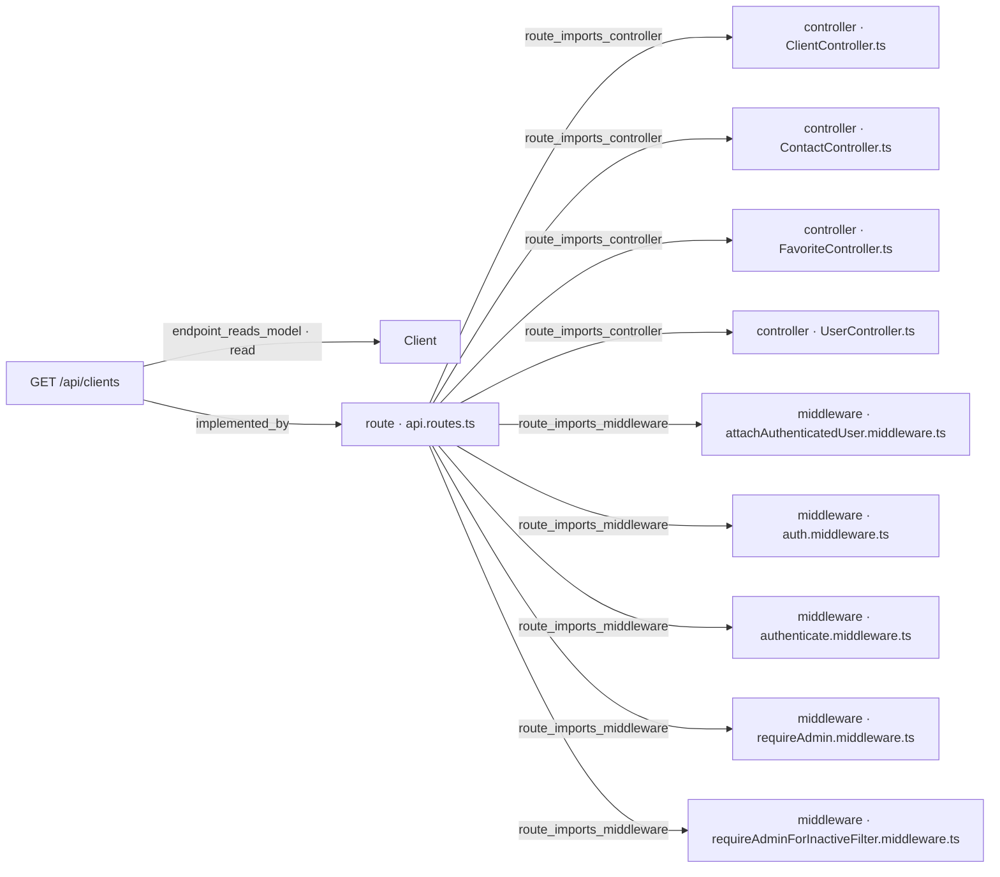

# [Documentation] Clients — Búsqueda de clientes por nombre

## Qué pide la spec

La spec [ancla:user_story HU-001] resuelve un problema concreto del frontend: para localizar un cliente, la interfaz debe recorrer el listado página a página, sin ningún mecanismo de filtrado por texto. La solución consiste en añadir al endpoint existente [ancla:endpoint GET /api/clients] un parámetro opcional `search` que devuelve únicamente los clientes cuyo **nombre** contiene el texto introducido, sin distinguir mayúsculas [spec:acceptance_criteria AC-01].

La spec no crea ninguna ruta nueva. La alternativa `/api/clients/search` fue descartada explícitamente porque colisiona con el segmento dinámico `/api/clients/:id` [spec:endpoint GET /api/clients]. El endpoint existente conserva su comportamiento íntegro cuando `search` está ausente [spec:acceptance_criteria AC-05].

Las reglas esenciales que gobiernan la búsqueda son cuatro:

- **Escape de metacaracteres** [spec:business_rule RN-01]: el texto del usuario se trata siempre como literal, nunca como expresión regular. Caracteres como `.*` o `?` no tienen significado especial. La búsqueda distingue acentos (`«Jose»` no encuentra a `«José»`), ya que la flag `i` de JavaScript no normaliza diacríticos.
- **Longitud mínima y máxima** [spec:business_rule RN-02]: `search` requiere entre 2 y 100 caracteres después de eliminar los espacios de los extremos. Un valor fuera de ese rango —incluyendo una cadena formada solo por espacios— produce un [spec:error VALIDATION_ERROR] HTTP 400.
- **Barrera de autorización intacta** [spec:business_rule RN-03]: la búsqueda no amplía los permisos de ningún usuario. El middleware `requireAdminForInactiveFilter` se ejecuta antes que la validación del parámetro `search`; un no administrador que solicite `status=inactive` recibe siempre [spec:error CLIENTS_FORBIDDEN_FILTER] HTTP 403, aunque `search` sea simultáneamente inválido.
- **Solo se busca en `name`** [spec:business_rule RN-04]: el campo `email` sale ofuscado en todas las respuestas mediante `toPublicClient`. Permitir búsqueda sobre él convertiría el endpoint en un oráculo que revelaría la dirección carácter a carácter.

Cuando la búsqueda no produce coincidencias, la respuesta es HTTP 200 con `items: []` y `total: 0` [spec:acceptance_criteria AC-06]. El total y la paginación reflejan únicamente los documentos que coinciden con el filtro [spec:acceptance_criteria AC-08]. El email ofuscado no puede sondearse a través del parámetro `search` [spec:acceptance_criteria AC-07].

---

## El trabajo y su historia

| work item | tipo | estado | asignado a |
|---|---|---|---|
| WI-API-CLIENTE-BUSQUEDA-001 | Backend | Mergeado | Jorge Developer |
| WI-API-CLIENTE-BUSQUEDA-002 | Documentación | MR Abierto · en revisión | Jorge Developer |

| fecha y hora (UTC) | work item | qué pasó | quién | motivo |
|---|---|---|---|---|
| 2026-09-30 03:36 | WI-API-CLIENTE-BUSQUEDA-001 | nace en «Generado» | Administrador Global | nacimiento del work item |
| 2026-09-30 03:36 | WI-API-CLIENTE-BUSQUEDA-002 | nace en «Generado» | Administrador Global | nacimiento del work item |
| 2026-09-30 03:37 | WI-API-CLIENTE-BUSQUEDA-001 | «Generado» → «Contexto Listo» | Administrador Global | context pack preparado |
| 2026-09-30 03:38 | WI-API-CLIENTE-BUSQUEDA-001 | «Contexto Listo» → «Aprobado» | Administrador Global | — |
| 2026-09-30 03:38 | WI-API-CLIENTE-BUSQUEDA-001 | «Aprobado» → «Asignado» | Administrador Global | asignación de work item |
| 2026-09-30 03:39 | WI-API-CLIENTE-BUSQUEDA-001 | «Asignado» → «En Progreso» | Administrador Global | Run autónomo 1dc25e3c-74bd-4ec4-b4a3-16681404508c (agente developer) |
| 2026-09-30 03:53 | WI-API-CLIENTE-BUSQUEDA-001 | PR #18 abierto | git | WI-API-CLIENTE-BUSQUEDA-001 · implementación autónoma |
| 2026-09-30 03:53 | WI-API-CLIENTE-BUSQUEDA-001 | «En Progreso» → «MR Abierto · en revisión» | sin actor registrado | automático: pull request #18 en feature/MEAN-API-CLIENTE-BUSQUEDA-001/WP-API-CLIENTE-BUSQUEDA-001 |
| 2026-09-30 11:55 | WI-API-CLIENTE-BUSQUEDA-002 | «Generado» → «Contexto Listo» | Administrador Global | context pack preparado |
| 2026-10-01 14:34 | WI-API-CLIENTE-BUSQUEDA-002 | «Contexto Listo» → «Aprobado» | Administrador Global | — |
| 2026-10-01 14:34 | WI-API-CLIENTE-BUSQUEDA-002 | «Aprobado» → «Asignado» | Administrador Global | asignación de work item |
| 2026-10-01 21:08 | WI-API-CLIENTE-BUSQUEDA-001 | PR #18 mergeado | git | WI-API-CLIENTE-BUSQUEDA-001 · implementación autónoma |
| 2026-10-04 01:45 | WI-API-CLIENTE-BUSQUEDA-001 | «MR Abierto · en revisión» → «Validado» | Administrador Global | — |
| 2026-10-04 01:45 | WI-API-CLIENTE-BUSQUEDA-001 | «Validado» → «Mergeado» | Administrador Global | — |
| 2026-10-04 01:51 | WI-API-CLIENTE-BUSQUEDA-002 | PR #21 abierto | git | WI-API-CLIENTE-BUSQUEDA-002 · documento técnico |
| 2026-10-04 01:51 | WI-API-CLIENTE-BUSQUEDA-002 | «Asignado» → «En Progreso» | sin actor registrado | automático: push 414b26010c84 en docs/MEAN-API-CLIENTE-BUSQUEDA-001/WI-API-CLIENTE-BUSQUEDA-002 |
| 2026-10-04 01:51 | WI-API-CLIENTE-BUSQUEDA-002 | «En Progreso» → «MR Abierto · en revisión» | sin actor registrado | automático: pull request #21 en docs/MEAN-API-CLIENTE-BUSQUEDA-001/WI-API-CLIENTE-BUSQUEDA-002 |

El trabajo de la spec se repartió en dos work items: [wi:WI-API-CLIENTE-BUSQUEDA-001] para el backend y este documento para la capa de documentación.

El work item de backend nació el 2026-09-30 a las 03:36 UTC y alcanzó el estado «En Progreso» en menos de tres minutos [estado:WI-API-CLIENTE-BUSQUEDA-001]. El agente developer abrió [git:PR #18] a las 03:53 del mismo día. El PR permaneció en revisión hasta el 2026-10-01 a las 21:08 UTC, cuando fue mergeado [estado:WI-API-CLIENTE-BUSQUEDA-001]. La transición formal a «Validado» y luego a «Mergeado» se registró el 2026-10-04 a las 01:45 UTC [estado:WI-API-CLIENTE-BUSQUEDA-001].

Este work item de documentación (WI-API-CLIENTE-BUSQUEDA-002) nació en paralelo el 2026-09-30 a las 03:36 UTC, pero su contexto no estuvo listo hasta las 11:55 del mismo día [estado:WI-API-CLIENTE-BUSQUEDA-002]. Fue aprobado y asignado el 2026-10-01 a las 14:34 UTC [estado:WI-API-CLIENTE-BUSQUEDA-002], y [git:PR #21] se abrió el 2026-10-04 a las 01:51 UTC, tras la validación del backend [estado:WI-API-CLIENTE-BUSQUEDA-002]. En el momento de redactar este documento, el PR #21 permanece abierto y en revisión.

La cronología no muestra ningún hueco anómalo: la secuencia de estados es continua y coherente con los eventos de git registrados.

---

## Lo que se tocó

### WI-API-CLIENTE-BUSQUEDA-001 · Backend · «Mergeado»
- Informe de finalización [informe:WI-API-CLIENTE-BUSQUEDA-001], 2026-10-01 21:08 UTC, commit 0668a02: 8 de 8 criterios cubiertos.
  - Lo que dijo al entregarlo: Implementados todos los criterios de HU-001: búsqueda por nombre en GET /api/clients mediante el parámetro opcional search (2-100 chars tras trim), con escape de caracteres regex (RN-01), validación en validateListClients (RN-02), conservación de la barrera 403 para no-admins antes de la validación (RN-03) y búsqueda exclusivamente en el campo name (RN-04). Tests unitarios de escapeRegex y ClientService.list con search en ClientService.test.ts; tests de integración de todos los ACs en clients.integration.test.ts. 133 tests en verde.
  - Pruebas ejecutadas: `api/src/services/ClientService.test.ts` (pass), `api/src/__tests__/clients.integration.test.ts` (pass), `api/src/__tests__/client-count.integration.test.ts` (pass), `api/src/__tests__/favorites.integration.test.ts` (pass), `api/src/services/FavoriteService.test.ts` (pass), `api/src/lib/obfuscate.test.ts` (pass)
  - Criterios y sus pruebas:
    - AC-01 (cubierto): Test de integración 'AC-01 — returns active clients whose name contains the search term (case-insensitive)' en api/src/__tests__/clients.integration.test.ts. Test unitario 'AC-01 — finds by name case-insensitively' en api/src/services/ClientService.test.ts. ClientService.list construye new RegExp(escapeRegex(search), 'i') sobre el campo name.
    - AC-02 (cubierto): Test de integración 'AC-02/RN-01 — ".*" is treated as a literal, not a regex wildcard' en api/src/__tests__/clients.integration.test.ts y test unitario equivalente en api/src/services/ClientService.test.ts. La función escapeRegex exportada de api/src/services/ClientService.ts escapa todos los metacaracteres de regex antes de construir el RegExp.
    - AC-03 (cubierto): Tres tests de integración en api/src/__tests__/clients.integration.test.ts: search=a (1 char), search=%20%20%20 (solo espacios, trim→vacío) y search de 101 chars responden 400 con {status:'error', message:'search must be between 2 and 100 characters'}. Validado con .trim().isLength({min:2,max:100}) en validateListClients (api/src/validators/client.validators.ts).
    - AC-04 (cubierto): Dos tests de integración en api/src/__tests__/clients.integration.test.ts: no-admin con search=ana&status=inactive y no-admin con search=a&status=inactive ambos reciben 403 CLIENTS_FORBIDDEN_FILTER, porque requireAdminForInactiveFilter va antes que validateListClients en la cadena de middlewares.
    - AC-05 (cubierto): Test de integración 'AC-05 — without search, returns full list with correct ids and total' en api/src/__tests__/clients.integration.test.ts. Test unitario 'AC-05 — without search returns all items unchanged' en api/src/services/ClientService.test.ts. Sin search, filter no incluye el campo name y el resultado es idéntico al listado existente.
    - AC-06 (cubierto): Test de integración 'AC-06 — no coincidences returns 200 with items [] and total 0' en api/src/__tests__/clients.integration.test.ts. Test unitario equivalente en api/src/services/ClientService.test.ts. La respuesta es 200 con items:[] y total:0, sin errores.
    - AC-07 (cubierto): Test de integración 'AC-07/RN-04 — search term found only in email does not return the client' en api/src/__tests__/clients.integration.test.ts: cliente name='Luis' email='ana@example.com', search=ana → total:0. Test unitario equivalente en api/src/services/ClientService.test.ts. El filtro Mongo solo aplica sobre el campo name.
    - AC-08 (cubierto): Test de integración 'AC-08 — total and pagination count only matching documents' en api/src/__tests__/clients.integration.test.ts: 25 clientes con 'ana' + 5 sin 'ana', ?search=ana&page=2&limit=10 → 10 items y total=25. Test unitario equivalente en api/src/services/ClientService.test.ts. find y countDocuments reciben el mismo objeto filter.
  - Decisiones:
    - convención seguida MINED-CONTACT-API-TS-001: 1: cadena de middlewares authenticate→attachAuthenticatedUser→requireAdminForInactiveFilter→validateListClients→ClientController.list, sin cambios. 2: authenticate (no authMiddleware) en rutas de clients. 3: attachAuthenticatedUser presente. 4: requireAdminForInactiveFilter en posición de autorización. 5: DuplicateEmailError y ClientNotFoundError en ClientService.ts. 6: controller captura errores de dominio y llama next(error) para el resto. 7: toPublicClient en todas las respuestas. 8: obfuscateValue en lib/obfuscate.ts. 9: IClient en models/client.ts. 10: ListClientsInput con search?: string. 11: lógica en ClientService, escapeRegex solo allí. 12: ClientController con firma estándar. 13: middlewares con sufijo .middleware.ts. 14: req.user declarado en authenticate.middleware.ts. 15: createApp() en app.ts. 16: connectDB en config/database.ts. 17: tests unitarios junto al servicio, integración en __tests__/. 18: unicidad en modelo. 19: normalizeEmail en servicio. 20: validateListClients en client.validators.ts.
  - Evidencias:
    - test_results `api/.sdd/evidence/test-results-WI-API-CLIENTE-BUSQUEDA-001.txt` (corroborada): Salida completa de npm test: 133 tests passing, 6 suites en verde. Incluye detalle de cobertura por fichero y listado de todos los tests que cubren cada AC de este WI.
    - coverage_report `api/coverage/coverage-summary.json`: Cobertura de los ficheros del WI: ClientService.ts 98.68% stmts / 96.07% branches / 100% funcs; client.validators.ts 96.66% stmts / 89.47% branches / 100% funcs. Ambos superan el umbral del 80%.
- Contratos del código: [codigo:GET /api/clients]
- Componentes: contact-api-ts
- Specs relacionadas: MEAN-API-CLIENTES-FAV-001, MINED-CONTACT-API-TS-001

### Ficheros del PR #18, mergeado el 2026-10-01 21:08 UTC: 10 ficheros, +1136 −40
| fichero | cambio | + | − |
|---|---|---|---|
| `api/src/__tests__/clients.integration.test.ts` | modificado | 255 | 0 |
| `api/src/controllers/ClientController.ts` | modificado | 202 | 1 |
| `api/src/services/ClientService.test.ts` | modificado | 172 | 1 |
| `api/.sdd/evidence/test-results.txt` | modificado | 75 | 35 |
| `.sdd/completion-report-WI-API-CLIENTE-BUSQUEDA-001.json` | añadido | 98 | 0 |
| `api/.sdd/completion-report-WI-API-CLIENTE-BUSQUEDA-001.json` | añadido | 98 | 0 |
| `api/.sdd/evidence/test-results-WI-API-CLIENTE-BUSQUEDA-001.txt` | añadido | 91 | 0 |
| `api/src/services/ClientService.ts` | modificado | 21 | 3 |
| `api/src/validators/client.validators.ts` | modificado | 5 | 0 |

No se listan los ficheros del propio documento: `docs/WI-API-CLIENTE-BUSQUEDA-002/README.md`.

El único work item de implementación es [wi:WI-API-CLIENTE-BUSQUEDA-001], mergeado mediante [git:PR #18] (10 ficheros, +1136 −40). Los cambios cubrieron los ocho criterios de aceptación de la spec [informe:WI-API-CLIENTE-BUSQUEDA-001].

Los ficheros de producción modificados fueron tres:

- **`api/src/services/ClientService.ts`** (+21 −3): incorpora la función `escapeRegex` y la lógica que, cuando `search` está presente, construye `new RegExp(escapeRegex(search), 'i')` sobre el campo `name` e inyecta ese filtro tanto en `find` como en `countDocuments` [informe:WI-API-CLIENTE-BUSQUEDA-001].
- **`api/src/controllers/ClientController.ts`** (+202 −1): adapta el controlador para extraer y propagar `search` desde la query al servicio [informe:WI-API-CLIENTE-BUSQUEDA-001].
- **`api/src/validators/client.validators.ts`** (+5 −0): añade la regla `.trim().isLength({ min: 2, max: 100 })` con mensaje explícito al validador `validateListClients` [informe:WI-API-CLIENTE-BUSQUEDA-001] [codigo:GET /api/clients].

Los ficheros de test ampliados fueron dos:

- **`api/src/__tests__/clients.integration.test.ts`** (+255 −0): tests de integración para los ocho ACs [informe:WI-API-CLIENTE-BUSQUEDA-001].
- **`api/src/services/ClientService.test.ts`** (+172 −1): tests unitarios de `escapeRegex` y de `ClientService.list` con y sin `search` [informe:WI-API-CLIENTE-BUSQUEDA-001].

El resto de los ficheros del PR corresponden a artefactos del proceso (informe de finalización, evidencias de test). La entidad [spec:entidad Client] no fue modificada: la spec la declara `existing_readonly`.

---

## Cómo está construido

El diagrama siguiente, derivado del grafo de conocimiento del repositorio, muestra cómo se articula el endpoint en la capa de routing:



El endpoint [arista:GET /api/clients→route · api.routes.ts] es implementado por `api.routes.ts` [arista:route · api.routes.ts→controller · ClientController.ts], que importa `ClientController.ts` y los middlewares necesarios. La cadena de middlewares para esta ruta, sin cambios respecto al listado previo [spec:endpoint GET /api/clients], es:

```
authenticate → attachAuthenticatedUser → requireAdminForInactiveFilter → validateListClients → ClientController.list
```

- `authenticate` [arista:route · api.routes.ts→middleware · authenticate.middleware.ts] verifica el Bearer JWT. La spec prohíbe usar `auth.middleware.ts` (legacy) [arista:route · api.routes.ts→middleware · auth.middleware.ts] en esta ruta.
- `attachAuthenticatedUser` [arista:route · api.routes.ts→middleware · attachAuthenticatedUser.middleware.ts] materializa el usuario en `req.user`.
- `requireAdminForInactiveFilter` [arista:route · api.routes.ts→middleware · requireAdminForInactiveFilter.middleware.ts] es la barrera de autorización para `status=inactive`; su posición anterior a la validación es la que garantiza [spec:business_rule RN-03].
- `validateListClients` (en `client.validators.ts`) aplica el trim y la comprobación de longitud sobre `search` [spec:business_rule RN-02].
- `ClientController.list` delega en `ClientService.list`, donde reside la lógica de construcción del filtro Mongo [informe:WI-API-CLIENTE-BUSQUEDA-001].

El endpoint lee únicamente el modelo [arista:GET /api/clients→Client] [spec:entidad Client]; no escribe ningún dato.

El grafo muestra que `api.routes.ts` también importa `requireAdmin.middleware.ts` [arista:route · api.routes.ts→middleware · requireAdmin.middleware.ts], aunque ese middleware no forma parte de la cadena de `GET /api/clients`; corresponde a otras rutas del mismo fichero de routing.

---

## Reglas de negocio

**RN-01 — El texto se trata como literal** [spec:business_rule RN-01]

Antes de construir el `RegExp`, `ClientService.ts` aplica `escapeRegex` sobre el valor de `search`. Esta función antepone `\` a cada carácter que tenga significado especial en una expresión regular (`. * + ? ^ $ { } ( ) | [ ] \`). El resultado es que el texto del usuario llega a Mongo siempre como patrón literal. La búsqueda distingue acentos porque la flag `i` de JavaScript no normaliza diacríticos; `«Jose»` y `«José»` son términos distintos.

**RN-02 — Longitud mínima 2, máxima 100** [spec:business_rule RN-02]

La validación se realiza en `validateListClients` con `.trim().isLength({ min: 2, max: 100 })`. El trim se aplica antes de medir: una cadena formada únicamente por espacios queda vacía tras el trim y cae por debajo del mínimo. La respuesta en todos los casos fuera de rango es [spec:error VALIDATION_ERROR] HTTP 400 con mensaje explícito.

**RN-03 — La barrera 403 va antes que la validación** [spec:business_rule RN-03]

`requireAdminForInactiveFilter` precede a `validateListClients` en la cadena. Un no administrador que envíe `status=inactive` recibirá [spec:error CLIENTS_FORBIDDEN_FILTER] HTTP 403 independientemente del valor de `search`. Un administrador, en cambio, sí llega al validador: `search=a&status=inactive` le devuelve HTTP 400.

**RN-04 — Solo `name`, nunca `email`** [spec:business_rule RN-04]

El filtro Mongo que construye `ClientService.list` opera exclusivamente sobre el campo `name`. El campo `email` pasa siempre por `toPublicClient` → `obfuscateValue` antes de salir en la respuesta, por lo que el usuario nunca puede sondear su valor a través del parámetro `search` [spec:acceptance_criteria AC-07].

---

## Cómo verificarlo

El informe de finalización [informe:WI-API-CLIENTE-BUSQUEDA-001] declara 8 de 8 criterios cubiertos, con 133 tests en verde en 6 suites.

| Criterio | Cobertura declarada |
|---|---|
| AC-01 [spec:acceptance_criteria AC-01] | Test de integración `'AC-01 — returns active clients whose name contains the search term (case-insensitive)'` + test unitario en `ClientService.test.ts` |
| AC-02 [spec:acceptance_criteria AC-02] | Test de integración `'AC-02/RN-01 — ".*" is treated as a literal, not a regex wildcard'` + test unitario equivalente |
| AC-03 [spec:acceptance_criteria AC-03] | Tres tests de integración: `search=a` (1 char), `search=%20%20%20` (solo espacios) y `search` de 101 chars → HTTP 400 |
| AC-04 [spec:acceptance_criteria AC-04] | Dos tests de integración: no-admin con `search=ana&status=inactive` y con `search=a&status=inactive` → HTTP 403 |
| AC-05 [spec:acceptance_criteria AC-05] | Test de integración `'AC-05 — without search, returns full list with correct ids and total'` + test unitario |
| AC-06 [spec:acceptance_criteria AC-06] | Test de integración `'AC-06 — no coincidences returns 200 with items [] and total 0'` + test unitario |
| AC-07 [spec:acceptance_criteria AC-07] | Test de integración `'AC-07/RN-04 — search term found only in email does not return the client'` (cliente `name='Luis'`, `email='ana@example.com'`, `search=ana` → `total: 0`) + test unitario |
| AC-08 [spec:acceptance_criteria AC-08] | Test de integración: 25 clientes con `'ana'` + 5 sin ella, `?search=ana&page=2&limit=10` → 10 items y `total=25` + test unitario |

Las suites ejecutadas fueron: `ClientService.test.ts`, `clients.integration.test.ts`, `client-count.integration.test.ts`, `favorites.integration.test.ts`, `FavoriteService.test.ts` y `obfuscate.test.ts` [informe:WI-API-CLIENTE-BUSQUEDA-001]. La cobertura de `ClientService.ts` alcanzó el 98,68 % de sentencias y 96,07 % de ramas; la de `client.validators.ts`, el 96,66 % de sentencias y 89,47 % de ramas, ambas por encima del umbral del 80 % [informe:WI-API-CLIENTE-BUSQUEDA-001].

---

## Notas para el mantenedor

**Rendimiento y límite de tiempo** [spec:endpoint GET /api/clients]: el filtro por `search` construye una expresión regular sin ancla de inicio o fin, lo que impide el uso de índices y obliga a un recorrido completo de la colección (`collection scan`). Esto es aceptable al tamaño actual de `clients`. Para proteger las conexiones frente a búsquedas lentas, `find` y `countDocuments` llevan `maxTimeMS(5000)`; si Mongo supera ese límite, la operación se cancela y el endpoint devuelve [spec:error INTERNAL_ERROR] HTTP 500. Si la colección crece significativamente, la salida prevista es un índice de texto en MongoDB, contemplada en una spec futura y fuera del alcance de este work item.

**Observabilidad** [spec:endpoint GET /api/clients]: el backend no monta ningún logger de peticiones en `app.ts`, y este cambio no añade ninguno. El término `search` no se escribe en ningún log. Si en el futuro se incorpora un logger de peticiones, `search` debe tratarse como dato personal (puede contener un nombre) y omitirse del registro.

**Distinción de acentos** [spec:business_rule RN-01]: la búsqueda no normaliza diacríticos. `«Jose»` no encontrará a `«José»`. Resolverlo requeriría collation de MongoDB o normalización previa del texto, y ambos quedan fuera del alcance de esta spec.

**`auth.middleware.ts` no se usa aquí** [spec:endpoint GET /api/clients]: el grafo muestra que `api.routes.ts` importa `auth.middleware.ts` [arista:route · api.routes.ts→middleware · auth.middleware.ts], pero la spec prohíbe expresamente su uso en las rutas de clientes (es middleware legacy que acepta token por query string). El mantenedor no debe añadirlo a la cadena de `GET /api/clients`.

**Estado actual de este documento**: [git:PR #21] está abierto y en revisión en la rama `docs/MEAN-API-CLIENTE-BUSQUEDA-001/WI-API-CLIENTE-BUSQUEDA-002` [estado:WI-API-CLIENTE-BUSQUEDA-002]. El backend asociado [wi:WI-API-CLIENTE-BUSQUEDA-001] ya está mergeado [estado:WI-API-CLIENTE-BUSQUEDA-001].