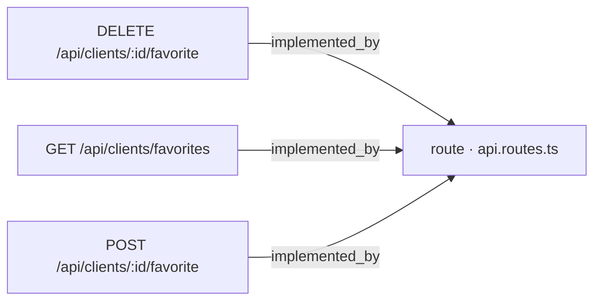
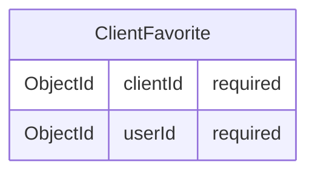

# [Documentation] Clients — API de favoritos de cliente

## Qué hace

Este work item documenta el contrato REST que permite a un usuario autenticado gestionar su lista de clientes favoritos. El contrato cubre tres operaciones: marcar un cliente como favorito [ancla:endpoint POST /api/clients/:id/favorite], desmarcar ese favorito [ancla:endpoint DELETE /api/clients/:id/favorite] y consultar el listado propio de favoritos [ancla:endpoint GET /api/clients/favorites].

La relación de favorito reside exclusivamente en la entidad [ancla:entity ClientFavorite] y no altera ningún campo del documento `Client` [spec:business_rule RN-02]. Las historias de usuario que motivaron este contrato son [ancla:user_story HU-01], [ancla:user_story HU-02], [ancla:user_story HU-03] y [ancla:user_story HU-04]; el doc-pack no incluye el texto de cada historia, únicamente sus identificadores.

La implementación de backend, la migración de base de datos y la suite de tests se recogen respectivamente en [wi:WI-API-CLIENTES-FAV-001], [wi:WI-API-CLIENTES-FAV-002] y [wi:WI-API-CLIENTES-FAV-003], todos en estado `closed`.

---

## Cómo está construido

### Enrutamiento

Los tres endpoints quedan registrados en un único punto de entrada de rutas:

Los tres endpoints —[ancla:endpoint POST /api/clients/:id/favorite] [arista:POST /api/clients/:id/favorite→route · api.routes.ts], [ancla:endpoint DELETE /api/clients/:id/favorite] [arista:DELETE /api/clients/:id/favorite→route · api.routes.ts] y [ancla:endpoint GET /api/clients/favorites] [arista:GET /api/clients/favorites→route · api.routes.ts]— están implementados por el mismo módulo de rutas `api.routes.ts`. El doc-pack no incluye información sobre capas intermedias (controlador, servicio, repositorio) más allá de este archivo de rutas.

### Modelo de datos

La relación de favorito se almacena en la entidad [ancla:entity ClientFavorite]:

[ancla:entity ClientFavorite] contiene únicamente dos campos obligatorios: `clientId`, que referencia al cliente marcado, y `userId`, que identifica al usuario que realizó el marcado. La combinación `(clientId, userId)` es la clave natural de la relación; la idempotencia de marcar/desmarcar descansa sobre ella [spec:business_rule RN-01]. El doc-pack no incluye información sobre índices de base de datos ni sobre restricciones de unicidad declaradas a nivel ORM.

---

## Reglas de negocio

### Idempotencia del marcado y desmarcado

Marcar un favorito es idempotente: dos llamadas consecutivas a [ancla:endpoint POST /api/clients/:id/favorite] sobre el mismo cliente no duplican la relación en [ancla:entity ClientFavorite]; la segunda llamada deja el sistema en el mismo estado que la primera [spec:business_rule RN-01]. El código de respuesta diferencia ambos casos: `201` cuando se crea la relación por primera vez [spec:acceptance_criteria AC-01] y `200` cuando ya existía [spec:acceptance_criteria AC-02].

Desmarcar también es idempotente: si el cliente no era favorito del usuario, [ancla:endpoint DELETE /api/clients/:id/favorite] responde `200` sin producir error [spec:acceptance_criteria AC-03].

### Aislamiento del documento Client

Ninguna operación de este contrato modifica campos del documento `Client` (`name`, `email`, `phone`, `status`) [spec:business_rule RN-02] [spec:acceptance_criteria AC-04]. La relación de favorito vive y muere en [ancla:entity ClientFavorite] sin efecto colateral sobre el cliente.

### Visibilidad por rol y manejo de clientes inactivos

La visibilidad del cliente subyacente sigue las mismas reglas que `ClientService.findById` [spec:business_rule RN-03]:

- Un usuario **sin rol admin** que invoca [ancla:endpoint POST /api/clients/:id/favorite] sobre un cliente inexistente recibe `404` [spec:acceptance_criteria AC-05].
- Un usuario **sin rol admin** que invoca ese mismo endpoint sobre un cliente **inactivo** también recibe `404`, sin revelar si el cliente existe pero está oculto [spec:acceptance_criteria AC-06].
- Un usuario **admin** puede marcar como favorito un cliente inactivo y recibe `201` o `200` según proceda, nunca `404` [spec:acceptance_criteria AC-12].

Cuando un cliente se desactiva, su relación en [ancla:entity ClientFavorite] **no se borra** [spec:business_rule RN-04] [spec:acceptance_criteria AC-07]. El efecto sobre la consulta de favoritos es el siguiente:

| Rol del usuario | Clientes incluidos en GET /api/clients/favorites |
|---|---|
| Sin admin | Solo favoritos de clientes activos [spec:acceptance_criteria AC-08] |
| Admin | Favoritos de clientes activos e inactivos [spec:acceptance_criteria AC-09] |

### Ofuscación de datos de contacto

Toda respuesta que incluya datos de un cliente —tanto en [ancla:endpoint POST /api/clients/:id/favorite] como en [ancla:endpoint DELETE /api/clients/:id/favorite] y [ancla:endpoint GET /api/clients/favorites]— pasa por `toPublicClient`, que ofusca `email` y `phone` [spec:business_rule RN-05] [spec:acceptance_criteria AC-10]. Esta ofuscación se aplica sin excepción de rol.

### Autenticación

Cualquier petición a los tres endpoints sin token válido recibe `401` [spec:business_rule RN-06] [spec:acceptance_criteria AC-11].

---

## Cómo verificarlo

Los escenarios de aceptación que debe cubrir cualquier suite de tests para este contrato son:

| AC | Endpoint | Escenario | Respuesta esperada |
|---|---|---|---|
| AC-01 | POST | Cliente existente, no era favorito | `201` + relación creada |
| AC-02 | POST | Cliente existente, ya era favorito | `200` + sin duplicado |
| AC-03 | DELETE | Cliente no era favorito | `200` sin error |
| AC-04 | POST / DELETE | Cualquier marcado/desmarcado | Campos del `Client` sin modificar |
| AC-05 | POST | Cliente inexistente | `404` |
| AC-06 | POST (sin admin) | Cliente inactivo | `404` |
| AC-07 | — | Desactivar cliente con favorito | `ClientFavorite` persiste |
| AC-08 | GET (sin admin) | Listar favoritos | Solo clientes activos |
| AC-09 | GET (admin) | Listar favoritos | Clientes activos e inactivos |
| AC-10 | POST / DELETE / GET | Respuesta con datos de cliente | `email` y `phone` ofuscados |
| AC-11 | POST / DELETE / GET | Sin token válido | `401` |
| AC-12 | POST (admin) | Cliente inactivo | `201` o `200`, nunca `404` |

La suite de tests correspondiente se recoge en [wi:WI-API-CLIENTES-FAV-003].

---

## Notas para el mantenedor

**Punto de extensión único.** Los tres endpoints comparten el mismo archivo de rutas `api.routes.ts` [arista:POST /api/clients/:id/favorite→route · api.routes.ts] [arista:DELETE /api/clients/:id/favorite→route · api.routes.ts] [arista:GET /api/clients/favorites→route · api.routes.ts]. Cualquier cambio en autenticación, validación de parámetros o middleware de ofuscación que afecte a los tres endpoints debe aplicarse en ese módulo.

**Idempotencia en la capa de persistencia.** La regla [spec:business_rule RN-01] requiere que la operación de inserción en [ancla:entity ClientFavorite] sea upsert o equivalente para garantizar que dos POST consecutivos no rompan la unicidad de `(clientId, userId)`. El doc-pack no incluye información sobre si esto se implementa mediante un índice único, una operación `findOrCreate` o una transacción; revisar [wi:WI-API-CLIENTES-FAV-002] para los detalles de la migración de base de datos.

**Divergencia de visibilidad entre marcar y listar.** El filtrado por estado activo/inactivo se aplica de forma diferente según la operación: en el marcado ([ancla:endpoint POST /api/clients/:id/favorite]) la visibilidad depende del rol en el momento de la llamada [spec:acceptance_criteria AC-06] [spec:acceptance_criteria AC-12]; en el listado ([ancla:endpoint GET /api/clients/favorites]) la visibilidad filtra retrospectivamente los favoritos ya existentes [spec:acceptance_criteria AC-08] [spec:acceptance_criteria AC-09]. Esto significa que un favorito de un cliente activo marcado por un usuario sin admin puede desaparecer del listado si el cliente se desactiva posteriormente, aunque la relación en [ancla:entity ClientFavorite] se conserve [spec:business_rule RN-04].

**Ofuscación sin excepción de rol.** La aplicación de `toPublicClient` es incondicional [spec:business_rule RN-05]. Si en el futuro se quisiera exponer datos no ofuscados para administradores en estos endpoints, sería necesario modificar explícitamente la lógica de serialización, ya que el contrato actual no contempla esa excepción.

**Fuera del alcance declarado.** El doc-pack indica explícitamente que compartir favoritos entre usuarios y el envío de notificaciones quedan fuera del alcance de este contrato. El doc-pack no incluye información sobre límites máximos de favoritos por usuario ni sobre ordenación del listado devuelto por [ancla:endpoint GET /api/clients/favorites].