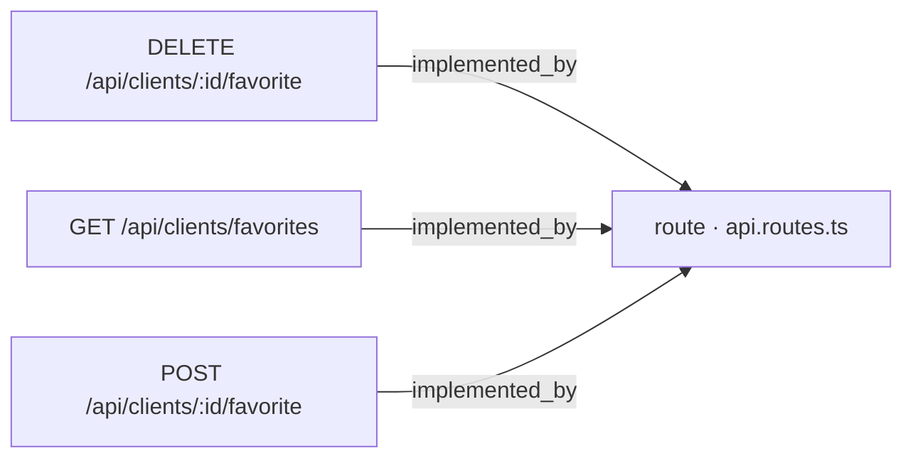
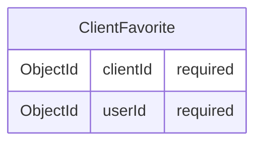

# [Documentation] Clients — API de favoritos

## Qué hace

Este work item documenta el subsistema de favoritos de clientes: el conjunto de endpoints y la entidad que permiten a un usuario marcar clientes como favoritos, desmarcarlos y consultar su lista personal de clientes favoritos.

Las historias de usuario que motivan este subsistema son [ancla:user_story HU-01], [ancla:user_story HU-02], [ancla:user_story HU-03] y [ancla:user_story HU-04]. El doc-pack no incluye el texto narrativo de cada historia, por lo que no es posible detallar aquí los criterios de aceptación específicos de cada una.

El subsistema expone tres operaciones sobre el recurso favorito:

- Crear un favorito: [ancla:endpoint POST /api/clients/:id/favorite]
- Eliminar un favorito: [ancla:endpoint DELETE /api/clients/:id/favorite]
- Listar los favoritos del usuario autenticado: [ancla:endpoint GET /api/clients/favorites]

## Cómo está construido

Los tres endpoints convergen en un único punto de registro de rutas. El siguiente diagrama, derivado del grafo de conocimiento, muestra esa relación:

Los tres endpoints —[ancla:endpoint POST /api/clients/:id/favorite], [ancla:endpoint DELETE /api/clients/:id/favorite] y [ancla:endpoint GET /api/clients/favorites]— están implementados a través del mismo fichero de enrutado `api.routes.ts` [arista:POST /api/clients/:id/favorite→route · api.routes.ts] [arista:DELETE /api/clients/:id/favorite→route · api.routes.ts] [arista:GET /api/clients/favorites→route · api.routes.ts].

El doc-pack no incluye información sobre las capas internas que `api.routes.ts` invoca (servicios, repositorios, controladores), por lo que no es posible documentar aquí el flujo de llamadas más allá del enrutado.

### Modelo de datos

La entidad que persiste la relación usuario-cliente favorito es [ancla:entity ClientFavorite]. Su esquema, tal como se detecta en el contrato ORM, es el siguiente:

[ancla:entity ClientFavorite] es una entidad de asociación pura: únicamente almacena el identificador del cliente (`clientId`) y el identificador del usuario que lo ha marcado como favorito (`userId`), ambos campos obligatorios. No contiene atributos adicionales de auditoría, orden ni metadatos según el doc-pack.

## Reglas de negocio

Las siguientes reglas se infieren directamente del contrato de la entidad y los endpoints:

1. **Alcance por usuario.** Dado que [ancla:entity ClientFavorite] incluye `userId` como campo requerido, cada registro de favorito pertenece a un usuario concreto. La lista devuelta por [ancla:endpoint GET /api/clients/favorites] debe corresponder exclusivamente al usuario autenticado en la sesión.

2. **Clave compuesta implícita.** El par (`clientId`, `userId`) identifica de forma unívoca un favorito. Marcar el mismo cliente dos veces por el mismo usuario sería una duplicidad; sin embargo, el doc-pack no incluye información sobre si existe una restricción de unicidad explícita en la capa de persistencia.

3. **Operaciones idempotentes por diseño REST.** [ancla:endpoint DELETE /api/clients/:id/favorite] sigue la semántica HTTP DELETE: elimina la asociación entre el cliente identificado por `:id` y el usuario autenticado. El doc-pack no incluye información sobre el comportamiento cuando el favorito no existe (p. ej., si devuelve 404 o 204 silencioso).

4. **Identificación del cliente vía parámetro de ruta.** Tanto [ancla:endpoint POST /api/clients/:id/favorite] como [ancla:endpoint DELETE /api/clients/:id/favorite] reciben el `clientId` como parámetro de ruta `:id`. El cuerpo de la petición y los parámetros de consulta no están especificados en el doc-pack.

## Cómo verificarlo

Para comprobar el correcto funcionamiento del subsistema se deben ejercitar los tres endpoints en orden lógico:

1. **Crear un favorito** — `POST /api/clients/:id/favorite` [ancla:endpoint POST /api/clients/:id/favorite]: enviar una petición autenticada con un `id` de cliente válido y verificar que se persiste un documento [ancla:entity ClientFavorite] con el `clientId` y el `userId` correctos.

2. **Listar favoritos** — `GET /api/clients/favorites` [ancla:endpoint GET /api/clients/favorites]: verificar que el cliente marcado en el paso anterior aparece en la respuesta y que no aparecen favoritos de otros usuarios.

3. **Eliminar un favorito** — `DELETE /api/clients/:id/favorite` [ancla:endpoint DELETE /api/clients/:id/favorite]: eliminar el favorito creado y confirmar que una llamada posterior a `GET /api/clients/favorites` ya no lo incluye.

El doc-pack no incluye información sobre códigos de respuesta HTTP esperados, esquemas de respuesta JSON ni colecciones de tests existentes.

## Notas para el mantenedor

- **Punto único de enrutado.** Los tres endpoints residen en `api.routes.ts` [arista:POST /api/clients/:id/favorite→route · api.routes.ts]. Cualquier cambio en autenticación, validación de parámetros o middleware de autorización que afecte a este recurso debe aplicarse en ese fichero o en los middlewares que lo preceden.

- **Capas internas no documentadas.** El doc-pack no proyecta al grafo las capas de servicio ni de repositorio que `api.routes.ts` invoca. Antes de modificar la lógica de persistencia de [ancla:entity ClientFavorite], se recomienda trazar manualmente esas dependencias para evitar efectos colaterales no documentados.

- **Esquema minimalista.** [ancla:entity ClientFavorite] no incluye campos de auditoría (`createdAt`, `updatedAt`) según el contrato ORM del doc-pack. Si en el futuro se necesita ordenar la lista de favoritos por fecha de creación, será necesario añadir esos campos con una migración de esquema.

- **Historias de usuario pendientes de cruzar.** Las historias [ancla:user_story HU-01], [ancla:user_story HU-02], [ancla:user_story HU-03] y [ancla:user_story HU-04] están referenciadas como anclas pero el doc-pack no incluye su texto. Se recomienda enlazar este documento con el tracker de historias para mantener la trazabilidad de requisitos.