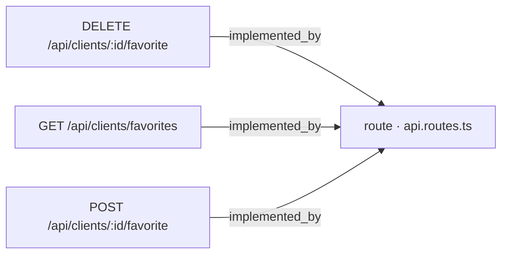
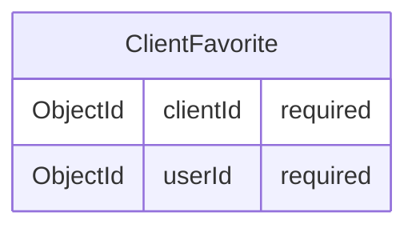

# [Documentation] Clients — API de Favoritos

## Qué hace

Este work item documenta los tres endpoints que permiten a un usuario gestionar su lista de clientes favoritos:

- Marcar un cliente como favorito [ancla:endpoint POST /api/clients/:id/favorite]
- Desmarcar un cliente como favorito [ancla:endpoint DELETE /api/clients/:id/favorite]
- Consultar la lista completa de clientes favoritos del usuario autenticado [ancla:endpoint GET /api/clients/favorites]

La funcionalidad está motivada por las historias de usuario HU-01, HU-02, HU-03 y HU-04 [ancla:user_story HU-01] [ancla:user_story HU-02] [ancla:user_story HU-03] [ancla:user_story HU-04]. El doc-pack no incluye información sobre el detalle narrativo de cada historia, por lo que no es posible precisar qué requisito específico cubre cada una.

---

## Cómo está construido

Los tres endpoints están registrados en el mismo fichero de enrutamiento central [arista:POST /api/clients/:id/favorite→route · api.routes.ts] [arista:DELETE /api/clients/:id/favorite→route · api.routes.ts] [arista:GET /api/clients/favorites→route · api.routes.ts]. No existe, según el grafo, un router específico para el subdominio de favoritos: las rutas se declaran directamente en `api.routes.ts`.

El grafo de conocimiento no proyecta aristas desde `api.routes.ts` hacia ningún servicio, controlador o repositorio, por lo que la cadena de llamadas interna (route → controller → service → repository) no puede describirse a partir del doc-pack sin inventar información.

El modelo de persistencia que respalda estas operaciones es la entidad `ClientFavorite` [ancla:entity ClientFavorite]:

La entidad registra exclusivamente la relación entre un cliente (`clientId`) y el usuario que lo ha marcado como favorito (`userId`), ambos campos obligatorios [ancla:entity ClientFavorite]. No contiene timestamps, metadatos adicionales ni campos opcionales según el contrato ORM incluido en el doc-pack.

---

## Reglas de negocio

Las siguientes reglas se deducen directamente del contrato de la entidad y la forma de los endpoints:

1. **Unicidad implícita por par (userId, clientId):** la clave lógica de `ClientFavorite` es la combinación de los dos campos requeridos [ancla:entity ClientFavorite]. Marcar el mismo cliente dos veces produciría un duplicado a menos que la capa de persistencia o de servicio aplique una restricción de unicidad; el doc-pack no incluye información sobre si dicha restricción existe.

2. **Identificación del cliente por ruta:** tanto el endpoint de marcado [ancla:endpoint POST /api/clients/:id/favorite] como el de desmarcado [ancla:endpoint DELETE /api/clients/:id/favorite] reciben el identificador del cliente como parámetro de ruta (`:id`). El doc-pack no especifica el formato esperado de ese identificador ni el comportamiento ante un `:id` inexistente o malformado.

3. **Consulta acotada al usuario autenticado:** el endpoint de listado [ancla:endpoint GET /api/clients/favorites] no incluye parámetros de ruta ni de consulta en el doc-pack, lo que implica que el filtro por usuario se resuelve a partir de la sesión o token del usuario autenticado. El doc-pack no incluye información sobre el mecanismo de autenticación empleado.

4. **Sin campos opcionales:** el contrato ORM de `ClientFavorite` declara ambos campos como `required` [ancla:entity ClientFavorite]; no es posible persistir un favorito sin `clientId` o sin `userId`.

---

## Cómo verificarlo

| Escenario | Endpoint | Condición mínima a comprobar |
|---|---|---|
| Marcar favorito | `POST /api/clients/:id/favorite` [ancla:endpoint POST /api/clients/:id/favorite] | Se crea un documento `ClientFavorite` con el `clientId` del parámetro de ruta y el `userId` del usuario autenticado [ancla:entity ClientFavorite] |
| Desmarcar favorito | `DELETE /api/clients/:id/favorite` [ancla:endpoint DELETE /api/clients/:id/favorite] | El documento `ClientFavorite` correspondiente deja de existir en la colección |
| Listar favoritos | `GET /api/clients/favorites` [ancla:endpoint GET /api/clients/favorites] | La respuesta contiene únicamente los clientes cuyo `userId` coincide con el del usuario autenticado [ancla:entity ClientFavorite] |

El doc-pack no incluye información sobre códigos de respuesta HTTP esperados, esquemas de respuesta JSON ni contratos de error, por lo que no es posible detallar aserciones sobre el cuerpo de la respuesta.

---

## Notas para el mantenedor

- **Punto único de registro de rutas:** los tres endpoints convergen en `api.routes.ts` [arista:POST /api/clients/:id/favorite→route · api.routes.ts] [arista:DELETE /api/clients/:id/favorite→route · api.routes.ts] [arista:GET /api/clients/favorites→route · api.routes.ts]. Cualquier cambio en el prefijo de ruta, en los guards de autenticación o en el middleware de validación debe aplicarse en ese fichero.

- **Modelo minimalista:** `ClientFavorite` solo almacena la relación [ancla:entity ClientFavorite]. Si en el futuro se necesita ordenación, fecha de creación u otros metadatos, habrá que extender el esquema ORM y actualizar los contratos de los tres endpoints.

- **Cadena interna no trazada:** el doc-pack no incluye información sobre los componentes intermedios (controlador, servicio, repositorio) que implementan la lógica de cada endpoint. Antes de modificar el comportamiento de cualquiera de los tres, se recomienda trazar esa cadena directamente en el código fuente.

- **Historias de usuario asociadas:** el work item referencia HU-01, HU-02, HU-03 y HU-04 [ancla:user_story HU-01] [ancla:user_story HU-02] [ancla:user_story HU-03] [ancla:user_story HU-04]; el doc-pack no incluye información sobre el contenido de cada historia, por lo que cualquier decisión de diseño que dependa de los criterios de aceptación originales debe consultarse en el sistema de gestión de producto.