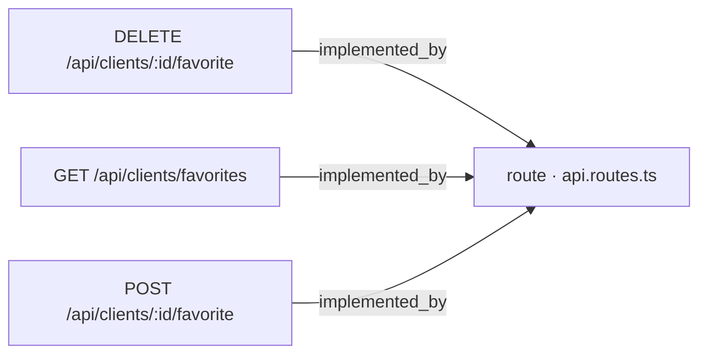
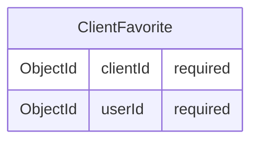

# [Documentation] Clients — API de favoritos de cliente

## Qué hace

Este work item documenta el contrato REST que permite a un usuario autenticado gestionar su lista de clientes favoritos. El contrato cubre tres operaciones: marcar un cliente como favorito [ancla:endpoint POST /api/clients/:id/favorite], desmarcar un cliente favorito [ancla:endpoint DELETE /api/clients/:id/favorite] y consultar el listado propio de favoritos [ancla:endpoint GET /api/clients/favorites].

La relación de favorito se modela en una entidad propia, independiente del ciclo de vida del cliente [ancla:entity ClientFavorite], de modo que ninguna de estas tres operaciones altera campos del documento `Client` —nombre, email, teléfono ni estado— [spec:business_rule RN-02]. Las historias de usuario que motivaron este contrato son [ancla:user_story HU-01], [ancla:user_story HU-02], [ancla:user_story HU-03] y [ancla:user_story HU-04]; el doc-pack no incluye información sobre el texto literal de cada una de ellas.

Quedan explícitamente fuera del alcance el compartir favoritos entre usuarios y el envío de notificaciones.

La implementación de backend, el esquema de base de datos y la suite de pruebas se encuentran en los work items relacionados [wi:WI-API-CLIENTES-FAV-001], [wi:WI-API-CLIENTES-FAV-002] y [wi:WI-API-CLIENTES-FAV-003], todos en estado *closed*.

---

## Cómo está construido

### Enrutamiento

Los tres endpoints están registrados en el fichero central de rutas de la aplicación. El grafo de conocimiento muestra las siguientes relaciones de implementación:

Las tres rutas convergen en `api.routes.ts` [arista:DELETE /api/clients/:id/favorite→route · api.routes.ts] [arista:GET /api/clients/favorites→route · api.routes.ts] [arista:POST /api/clients/:id/favorite→route · api.routes.ts]. El doc-pack no incluye información sobre los controladores o servicios intermedios que `api.routes.ts` invoca.

### Modelo de datos

La relación de favorito reside en la entidad `ClientFavorite`, que recoge exclusivamente los identificadores de las dos partes de la relación:

[ancla:entity ClientFavorite] — `clientId` referencia al cliente marcado como favorito y `userId` al usuario que lo marcó. Ambos campos son obligatorios. El doc-pack no incluye información sobre índices, restricciones de unicidad a nivel de base de datos ni colección de destino; esos detalles corresponden a [wi:WI-API-CLIENTES-FAV-002].

---

## Reglas de negocio

### Idempotencia de marcar y desmarcar

Las operaciones de marcar y desmarcar son idempotentes [spec:business_rule RN-01]:

- Dos llamadas consecutivas a [ancla:endpoint POST /api/clients/:id/favorite] sobre el mismo cliente dejan una única relación `ClientFavorite`. La primera llamada responde `201 Created` [spec:acceptance_criteria AC-01]; la segunda responde `200 OK` sin crear duplicado [spec:acceptance_criteria AC-02].
- Una llamada a [ancla:endpoint DELETE /api/clients/:id/favorite] sobre un cliente que ya no era favorito responde `200 OK` sin error [spec:acceptance_criteria AC-03].

### Aislamiento del documento Client

Marcar o desmarcar un favorito no modifica en ningún caso los campos `name`, `email`, `phone` ni `status` del documento `Client` [spec:business_rule RN-02] [spec:acceptance_criteria AC-04].

### Visibilidad de clientes según rol

El contrato reutiliza la misma lógica de visibilidad que el resto de la API de clientes [spec:business_rule RN-03]:

- Un usuario **sin rol admin** que intente marcar como favorito un cliente inexistente recibe `404` [spec:acceptance_criteria AC-05].
- Un usuario **sin rol admin** que intente marcar como favorito un cliente **inactivo** recibe igualmente `404`, sin revelar si el cliente existe [spec:acceptance_criteria AC-06].
- Un **admin** puede marcar como favorito un cliente inactivo y obtiene `201`/`200` en lugar de `404` [spec:acceptance_criteria AC-12].

### Persistencia del favorito ante desactivación

Cuando un cliente se desactiva, su relación `ClientFavorite` se conserva; el sistema no la elimina [spec:business_rule RN-04] [spec:acceptance_criteria AC-07]. No obstante, la visibilidad en el listado depende del rol:

- Un usuario **sin rol admin** que consulte [ancla:endpoint GET /api/clients/favorites] no verá favoritos de clientes inactivos [spec:acceptance_criteria AC-08].
- Un **admin** que consulte el mismo endpoint verá favoritos de clientes activos e inactivos [spec:acceptance_criteria AC-09].

### Ofuscación de datos de contacto

Toda respuesta que incluya datos de un cliente aplica `toPublicClient`, que ofusca `email` y `phone`, sin excepción de rol [spec:business_rule RN-05] [spec:acceptance_criteria AC-10]. El doc-pack no incluye información sobre el algoritmo concreto de ofuscación de `toPublicClient`.

### Autenticación obligatoria

Cualquier petición a los tres endpoints sin sesión válida recibe `401 Unauthorized` [spec:business_rule RN-06] [spec:acceptance_criteria AC-11].

---

## Cómo verificarlo

Los criterios de aceptación que deben cubrir las pruebas de este contrato son:

| AC | Endpoint | Escenario | Resultado esperado |
|----|----------|-----------|-------------------|
| AC-01 | [ancla:endpoint POST /api/clients/:id/favorite] | Cliente existente, no era favorito | `201 Created`, relación creada |
| AC-02 | [ancla:endpoint POST /api/clients/:id/favorite] | Segunda llamada sobre el mismo cliente | `200 OK`, sin duplicado |
| AC-03 | [ancla:endpoint DELETE /api/clients/:id/favorite] | Cliente que no era favorito | `200 OK`, sin error |
| AC-04 | POST / DELETE | Cualquier operación de favorito | Ningún campo de `Client` modificado |
| AC-05 | [ancla:endpoint POST /api/clients/:id/favorite] | `id` inexistente | `404` |
| AC-06 | [ancla:endpoint POST /api/clients/:id/favorite] | Cliente inactivo, usuario sin admin | `404` |
| AC-07 | Desactivación de cliente | Cliente era favorito antes de desactivarse | Relación `ClientFavorite` permanece |
| AC-08 | [ancla:endpoint GET /api/clients/favorites] | Usuario sin admin | No incluye favoritos de clientes inactivos |
| AC-09 | [ancla:endpoint GET /api/clients/favorites] | Admin | Incluye favoritos de clientes activos e inactivos |
| AC-10 | POST / DELETE / GET | Cualquier respuesta con datos de cliente | `email` y `phone` ofuscados vía `toPublicClient` |
| AC-11 | Los tres endpoints | Sin token válido | `401 Unauthorized` |
| AC-12 | [ancla:endpoint POST /api/clients/:id/favorite] | Cliente inactivo, usuario admin | `201`/`200`, relación creada |

La suite de pruebas asociada a estos criterios se encuentra en [wi:WI-API-CLIENTES-FAV-003].

---

## Notas para el mantenedor

**Idempotencia:** la garantía de no duplicación de [spec:business_rule RN-01] debe mantenerse a nivel de lógica de negocio o de base de datos. Si se modifica el mecanismo de persistencia de [ancla:entity ClientFavorite], hay que asegurar que dos `POST` consecutivos siguen produciendo una sola relación. Los detalles del esquema de base de datos están en [wi:WI-API-CLIENTES-FAV-002].

**Visibilidad asimétrica por rol:** la diferencia de comportamiento entre admin y usuario estándar afecta tanto a los endpoints de escritura ([spec:acceptance_criteria AC-06] vs. [spec:acceptance_criteria AC-12]) como al de lectura ([spec:acceptance_criteria AC-08] vs. [spec:acceptance_criteria AC-09]). Cualquier cambio en la lógica de roles del servicio de clientes puede romper este contrato de forma silenciosa; véase [spec:business_rule RN-03].

**Ofuscación sin excepción de rol:** a diferencia de otros contextos donde el rol puede influir en el nivel de detalle de la respuesta, `toPublicClient` se aplica siempre en este contrato [spec:business_rule RN-05]. No debe añadirse ninguna ruta de código que devuelva `email` o `phone` sin ofuscar, aunque el solicitante sea admin.

**Favoritos huérfanos:** la relación `ClientFavorite` puede quedar apuntando a un cliente inactivo indefinidamente [spec:business_rule RN-04]. No existe, dentro del alcance de este contrato, ningún mecanismo de limpieza automática. Si en el futuro se introduce la eliminación física de clientes, habrá que decidir explícitamente qué ocurre con sus `ClientFavorite` asociados.

**Capas no proyectadas en el grafo:** el doc-pack no incluye información sobre controladores, servicios ni repositorios que median entre `api.routes.ts` y la base de datos. Cualquier refactor de esas capas internas debe validarse contra los criterios de aceptación de [wi:WI-API-CLIENTES-FAV-003].