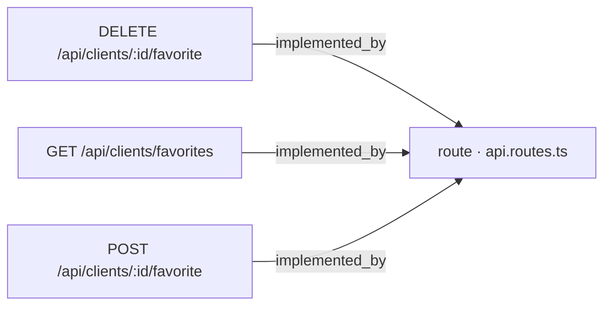
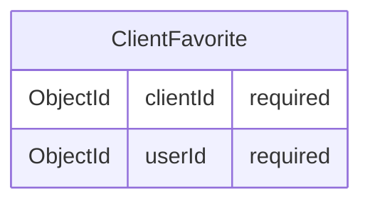

# WI-API-CLIENTES-FAV-004 — Documentación de API: favoritos de cliente

## Qué hace

Este work item documenta el contrato REST que permite a un usuario autenticado marcar clientes como favoritos, desmarcarlos y consultar su lista de favoritos. El contrato se materializa en tres endpoints: [ancla:endpoint POST /api/clients/:id/favorite], [ancla:endpoint DELETE /api/clients/:id/favorite] y [ancla:endpoint GET /api/clients/favorites].

La funcionalidad cubre las historias de usuario [ancla:user_story HU-01], [ancla:user_story HU-02], [ancla:user_story HU-03] y [ancla:user_story HU-04]. El doc-pack no incluye el texto literal de cada historia, por lo que no es posible detallar aquí su enunciado concreto.

La relación de favorito es independiente del ciclo de vida del cliente: ninguna operación de este contrato altera campos del documento `Client` [spec:business_rule RN-02]. La implementación de backend, el modelo de datos y los tests se ejecutaron en work items previos de la misma spec: [wi:WI-API-CLIENTES-FAV-001], [wi:WI-API-CLIENTES-FAV-002] y [wi:WI-API-CLIENTES-FAV-003].

---

## Cómo está construido

### Enrutamiento

Los tres endpoints quedan registrados en el fichero de rutas central de la aplicación. El grafo de conocimiento refleja la siguiente topología:

Los tres endpoints convergen en `api.routes.ts` [arista:DELETE /api/clients/:id/favorite→route · api.routes.ts] [arista:GET /api/clients/favorites→route · api.routes.ts] [arista:POST /api/clients/:id/favorite→route · api.routes.ts]. El doc-pack no incluye información sobre los handlers intermedios (controlador, servicio ni repositorio) más allá de este punto de entrada, por lo que no es posible documentar esa cadena de llamadas.

### Entidad de dominio

La relación de favorito reside exclusivamente en la entidad propia `ClientFavorite`, compuesta por dos campos obligatorios:

[ancla:entity ClientFavorite] registra la tupla `(clientId, userId)` como unidad mínima de la relación. Al ser una entidad separada, el documento `Client` no es tocado al crear o eliminar un favorito [spec:business_rule RN-02].

---

## Reglas de negocio

### Idempotencia

Las operaciones de marcar y desmarcar favorito son idempotentes [spec:business_rule RN-01]:

- Dos llamadas consecutivas a [ancla:endpoint POST /api/clients/:id/favorite] sobre el mismo cliente producen una única relación `ClientFavorite`. La primera responde `201` [spec:acceptance_criteria AC-01]; la segunda responde `200` sin duplicar el registro [spec:acceptance_criteria AC-02].
- Una llamada a [ancla:endpoint DELETE /api/clients/:id/favorite] sobre un cliente que no era favorito responde `200` sin error [spec:acceptance_criteria AC-03].

### Integridad del documento Client

Ninguna operación de este contrato modifica los campos `name`, `email`, `phone` ni `status` del cliente [spec:business_rule RN-02] [spec:acceptance_criteria AC-04].

### Visibilidad según rol y estado del cliente

La visibilidad de clientes inactivos depende del rol del usuario autenticado:

- Un usuario **sin rol admin** que intenta marcar como favorito un cliente inactivo recibe `404` [spec:acceptance_criteria AC-06], el mismo código que devolvería para un cliente inexistente [spec:business_rule RN-03]. Esto evita revelar si el recurso existe pero está oculto.
- Un **admin** puede marcar como favorito un cliente inactivo y recibe `201`/`200` en lugar de `404` [spec:acceptance_criteria AC-12].
- Al listar con [ancla:endpoint GET /api/clients/favorites], un usuario sin rol admin no ve favoritos de clientes inactivos [spec:acceptance_criteria AC-08]; un admin sí los ve [spec:acceptance_criteria AC-09].

### Persistencia del favorito al desactivar un cliente

Cuando un cliente que era favorito de algún usuario es desactivado, la relación `ClientFavorite` correspondiente se conserva; no se elimina en cascada [spec:business_rule RN-04] [spec:acceptance_criteria AC-07]. Un admin puede seguir viéndola en su listado [spec:acceptance_criteria AC-09].

### Ofuscación de datos de cliente

Toda respuesta que incluya datos de un cliente —independientemente del rol del solicitante— aplica la transformación `toPublicClient`, que ofusca los campos `email` y `phone` [spec:business_rule RN-05] [spec:acceptance_criteria AC-10]. No existe excepción de rol para esta regla.

### Autenticación

Cualquier petición a los tres endpoints sin un token de sesión válido recibe `401` [spec:business_rule RN-06] [spec:acceptance_criteria AC-11].

---

## Cómo verificarlo

Los escenarios de verificación se derivan directamente de los criterios de aceptación de la spec. La batería de tests que los cubre se implementó en [wi:WI-API-CLIENTES-FAV-003].

| Escenario | Endpoint | Condición | Resultado esperado |
|---|---|---|---|
| Marcar favorito nuevo | `POST /api/clients/:id/favorite` | Cliente activo, usuario autenticado, primera llamada | `201` + relación creada [spec:acceptance_criteria AC-01] |
| Marcar favorito duplicado | `POST /api/clients/:id/favorite` | Segunda llamada sobre el mismo cliente | `200` + una sola relación [spec:acceptance_criteria AC-02] |
| Desmarcar sin relación previa | `DELETE /api/clients/:id/favorite` | Cliente no era favorito | `200` sin error [spec:acceptance_criteria AC-03] |
| Cliente no modificado | `POST` o `DELETE` | Cualquier operación de favorito | Campos de `Client` sin cambios [spec:acceptance_criteria AC-04] |
| Cliente inexistente | `POST /api/clients/:id/favorite` | `id` no existe en base de datos | `404` [spec:acceptance_criteria AC-05] |
| Cliente inactivo, sin admin | `POST /api/clients/:id/favorite` | Usuario sin rol admin | `404` [spec:acceptance_criteria AC-06] |
| Cliente inactivo, admin | `POST /api/clients/:id/favorite` | Usuario con rol admin | `201`/`200` [spec:acceptance_criteria AC-12] |
| Favorito persiste al desactivar | — | Cliente desactivado con favorito previo | Relación `ClientFavorite` intacta [spec:acceptance_criteria AC-07] |
| Listado sin admin | `GET /api/clients/favorites` | Usuario sin rol admin | Solo clientes activos [spec:acceptance_criteria AC-08] |
| Listado admin | `GET /api/clients/favorites` | Usuario con rol admin | Activos e inactivos [spec:acceptance_criteria AC-09] |
| Ofuscación | Cualquier endpoint con respuesta de cliente | Cualquier rol | `email` y `phone` ofuscados [spec:acceptance_criteria AC-10] |
| Sin sesión | Cualquiera de los 3 endpoints | Sin token válido | `401` [spec:acceptance_criteria AC-11] |

---

## Notas para el mantenedor

**Idempotencia en base de datos.** La regla [spec:business_rule RN-01] exige que no se duplique la tupla `(clientId, userId)` en `ClientFavorite` [ancla:entity ClientFavorite]. Si se modifican las operaciones de escritura, se debe garantizar que el mecanismo de upsert o la restricción de unicidad en base de datos (implementada en [wi:WI-API-CLIENTES-FAV-002]) siga vigente.

**Capa de ofuscación obligatoria.** `toPublicClient` es una transformación sin excepción de rol [spec:business_rule RN-05]. Cualquier nueva ruta que exponga datos de cliente dentro de este contrato debe pasar por ella antes de serializar la respuesta.

**Opacidad ante clientes inactivos.** El código `404` para clientes inactivos vistos por usuarios sin rol admin [spec:business_rule RN-03] es deliberado: equipara la respuesta con la de un recurso inexistente. No se debe cambiar a `403` sin revisar el impacto en seguridad de la información.

**Favoritos huérfanos.** La persistencia del favorito al desactivar un cliente [spec:business_rule RN-04] implica que puede haber registros `ClientFavorite` apuntando a clientes inactivos. El listado [ancla:endpoint GET /api/clients/favorites] filtra estos registros por rol; cualquier consulta adicional sobre `ClientFavorite` debe reproducir ese filtro o ser consciente de que la colección puede contener referencias a clientes no activos.

**Arquitectura interna más allá del enrutador.** El doc-pack solo expone la arista desde los endpoints hasta `api.routes.ts` [arista:POST /api/clients/:id/favorite→route · api.routes.ts]. El doc-pack no incluye información sobre la cadena controlador → servicio → repositorio para este contrato; consultar [wi:WI-API-CLIENTES-FAV-001] para el detalle de implementación backend.