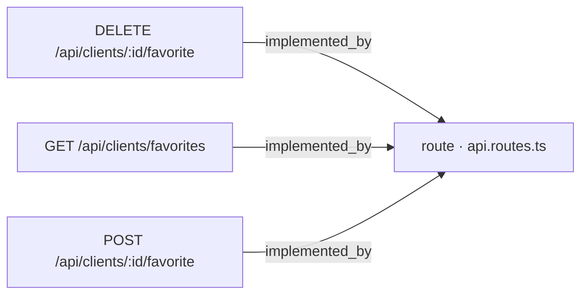
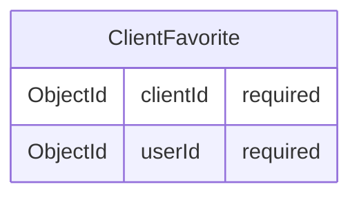

# [Documentation] Clients — API de favoritos de cliente

## Qué hace

Este work item documenta el contrato REST que permite a un usuario autenticado gestionar sus clientes favoritos. El contrato expone tres operaciones: marcar un cliente como favorito [ancla:endpoint POST /api/clients/:id/favorite], desmarcar ese favorito [ancla:endpoint DELETE /api/clients/:id/favorite] y consultar el listado de clientes favoritos del usuario en sesión [ancla:endpoint GET /api/clients/favorites].

La relación de favorito es independiente del ciclo de vida del cliente: ninguna de estas operaciones altera los campos `name`, `email`, `phone` ni `status` del documento `Client` [spec:business_rule RN-02]. La relación reside en su propia entidad [ancla:entity ClientFavorite] y persiste aunque el cliente sea desactivado [spec:business_rule RN-04].

Los work items de implementación, base de datos y testing correspondientes a esta misma spec son [wi:WI-API-CLIENTES-FAV-001], [wi:WI-API-CLIENTES-FAV-002] y [wi:WI-API-CLIENTES-FAV-003], todos en estado closed.

El doc-pack no incluye información sobre a qué historias de usuario concretas (HU-01 a HU-04) corresponde cada endpoint más allá de su mención como anclas [ancla:user_story HU-01] [ancla:user_story HU-02] [ancla:user_story HU-03] [ancla:user_story HU-04].

---

## Cómo está construido

### Enrutamiento

Los tres endpoints quedan registrados en el fichero central de rutas de la aplicación. El grafo de conocimiento muestra las siguientes aristas de implementación:

Las tres operaciones [arista:DELETE /api/clients/:id/favorite→route · api.routes.ts] [arista:GET /api/clients/favorites→route · api.routes.ts] [arista:POST /api/clients/:id/favorite→route · api.routes.ts] convergen en `api.routes.ts`, lo que implica que la guarda de autenticación y cualquier middleware transversal se aplica en ese mismo punto de entrada.

El doc-pack no incluye información sobre capas intermedias (controlador, servicio, repositorio) entre `api.routes.ts` y la entidad `ClientFavorite`; esas dependencias no aparecen en el grafo derivado del repositorio.

### Modelo de datos

La relación de favorito se almacena en la entidad `ClientFavorite` [ancla:entity ClientFavorite], cuyo esquema ORM contiene exactamente dos campos:

Ambos campos son obligatorios. El par `(clientId, userId)` identifica unívocamente la relación: marcar el mismo cliente dos veces no genera un segundo documento gracias a la idempotencia descrita en [spec:business_rule RN-01]. El doc-pack no incluye información sobre índices de base de datos ni sobre la constraint que hace cumplir esa unicidad a nivel de almacenamiento; ese detalle corresponde a [wi:WI-API-CLIENTES-FAV-002].

---

## Reglas de negocio

### Idempotencia de marcar y desmarcar

Marcar un favorito es idempotente [spec:business_rule RN-01]: dos llamadas consecutivas a [ancla:endpoint POST /api/clients/:id/favorite] sobre el mismo cliente dejan una única relación `ClientFavorite`. La primera llamada crea la relación y responde `201` [spec:acceptance_criteria AC-01]; la segunda detecta que ya existe y responde `200` sin crear un duplicado [spec:acceptance_criteria AC-02].

Desmarcar también es idempotente: llamar a [ancla:endpoint DELETE /api/clients/:id/favorite] sobre un cliente que no era favorito responde `200` sin error [spec:acceptance_criteria AC-03].

### Aislamiento del documento Client

Ninguna operación de este contrato modifica campos del documento `Client` [spec:business_rule RN-02] [spec:acceptance_criteria AC-04]. La relación de favorito existe únicamente en `ClientFavorite` [ancla:entity ClientFavorite].

### Visibilidad según rol y estado del cliente

El sistema aplica las siguientes reglas de visibilidad:

| Situación | Usuario sin rol admin | Admin |
|---|---|---|
| Cliente activo, POST favorito | `201` / `200` [spec:acceptance_criteria AC-01] [spec:acceptance_criteria AC-02] | `201` / `200` |
| Cliente inactivo, POST favorito | `404` [spec:acceptance_criteria AC-06] | `201` / `200` [spec:acceptance_criteria AC-12] |
| Cliente inexistente, POST favorito | `404` [spec:acceptance_criteria AC-05] | `404` |
| GET favoritos — clientes inactivos incluidos | No [spec:acceptance_criteria AC-08] | Sí [spec:acceptance_criteria AC-09] |

La respuesta `404` ante un cliente inactivo sin permiso de verlo es deliberada: el sistema no revela si el cliente existe pero está oculto, igualando la respuesta a la de un cliente inexistente [spec:business_rule RN-03].

### Persistencia del favorito ante desactivación

Cuando un cliente que ya era favorito se desactiva, la relación `ClientFavorite` no se borra [spec:business_rule RN-04] [spec:acceptance_criteria AC-07]. El favorito queda en base de datos, pero solo un admin lo verá al invocar [ancla:endpoint GET /api/clients/favorites] [spec:acceptance_criteria AC-08] [spec:acceptance_criteria AC-09].

### Ofuscación de datos del cliente

Toda respuesta que incluya datos de cliente pasa por `toPublicClient`, que ofusca los campos `email` y `phone` [spec:business_rule RN-05] [spec:acceptance_criteria AC-10]. Esta regla no admite excepciones por rol: ni siquiera los admins reciben esos campos en claro a través de este contrato.

### Autenticación obligatoria

Cualquier petición a los tres endpoints sin token de sesión válido recibe `401` [spec:business_rule RN-06] [spec:acceptance_criteria AC-11].

---

## Cómo verificarlo

Los criterios de aceptación enumerados en la spec cubren los siguientes escenarios de prueba, todos ellos derivados de [wi:WI-API-CLIENTES-FAV-003]:

1. **Marcar por primera vez** → respuesta `201` y una sola relación creada [spec:acceptance_criteria AC-01].
2. **Marcar dos veces** → segunda llamada responde `200`, base de datos sigue teniendo una sola relación [spec:acceptance_criteria AC-02].
3. **Desmarcar sin haber marcado** → responde `200` sin error ni efecto secundario [spec:acceptance_criteria AC-03].
4. **Ningún campo de Client mutado** → comparar documento `Client` antes y después de marcar/desmarcar [spec:acceptance_criteria AC-04].
5. **Id inexistente** → responde `404` [spec:acceptance_criteria AC-05].
6. **Cliente inactivo, usuario sin admin** → responde `404` [spec:acceptance_criteria AC-06].
7. **Cliente inactivo, admin** → responde `201`/`200`, no `404` [spec:acceptance_criteria AC-12].
8. **Desactivar cliente favorito** → relación `ClientFavorite` persiste [spec:acceptance_criteria AC-07].
9. **GET favoritos sin admin** → clientes inactivos no aparecen [spec:acceptance_criteria AC-08].
10. **GET favoritos con admin** → clientes activos e inactivos aparecen [spec:acceptance_criteria AC-09].
11. **Ofuscación en toda respuesta** → `email` y `phone` ofuscados independientemente del rol [spec:acceptance_criteria AC-10].
12. **Sin token** → los tres endpoints responden `401` [spec:acceptance_criteria AC-11].

---

## Notas para el mantenedor

- **Idempotencia en base de datos**: la regla [spec:business_rule RN-01] requiere que la capa de persistencia distinga entre "ya existía" y "se acaba de crear" para devolver `200` o `201` respectivamente. El doc-pack no incluye información sobre el mecanismo exacto (upsert, find-or-create, índice único) que lo garantiza; consultar [wi:WI-API-CLIENTES-FAV-002].

- **Sincronía entre desactivación de cliente y listado de favoritos**: la relación `ClientFavorite` [ancla:entity ClientFavorite] no se borra cuando se desactiva un cliente [spec:business_rule RN-04]. El filtrado por estado ocurre en tiempo de consulta ([ancla:endpoint GET /api/clients/favorites]), no en tiempo de escritura. Cualquier cambio en la lógica de desactivación de clientes debe tener en cuenta que los favoritos "huérfanos" (de clientes inactivos) permanecen almacenados y son visibles para admins.

- **Ofuscación sin excepción de rol**: `toPublicClient` se aplica siempre [spec:business_rule RN-05]. Si en el futuro se necesitara exponer datos en claro para algún rol a través de este contrato, se requeriría un cambio explícito en la spec, no basta con omitir la transformación.

- **Enrutamiento centralizado**: los tres endpoints convergen en `api.routes.ts` [arista:POST /api/clients/:id/favorite→route · api.routes.ts] [arista:DELETE /api/clients/:id/favorite→route · api.routes.ts] [arista:GET /api/clients/favorites→route · api.routes.ts]. La guarda de autenticación que hace cumplir [spec:business_rule RN-06] debe estar activa en ese fichero o en un middleware previo; desactivarla o reordenarla afecta a los tres endpoints simultáneamente.

- **Compartir favoritos entre usuarios y notificaciones** quedan explícitamente fuera del alcance de este contrato según la spec de origen. Cualquier extensión en esa dirección requiere un nuevo work item.