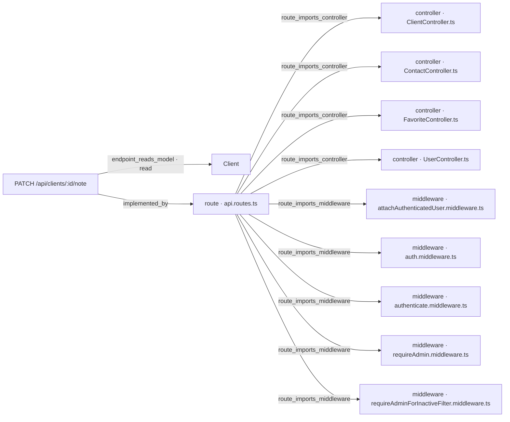

# [Documentation] Clients — Nota interna de cliente (`PATCH /api/clients/:id/note`)

## Qué pide la spec

La historia de usuario [spec:seccion HU-001: Guardar una nota interna sobre un cliente] describe la necesidad de cualquier usuario autenticado del CRM de registrar una nota interna corta sobre un cliente —por ejemplo, "prefiere contacto por la tarde"— para que quede visible a cualquiera que consulte su ficha. El problema que resuelve es la ausencia de un campo de texto libre asociado al cliente donde anotar observaciones informales sin estructura.

El contrato se materializa en un único endpoint nuevo [spec:endpoint PATCH /api/clients/:id/note]: recibe `{ internalNote: string | null }`, persiste el valor en el documento del cliente y devuelve el cliente completo. La autenticación es obligatoria y reutiliza el mismo middleware que protege el resto de `/api/clients/*` [spec:seccion Seguridad].

Los criterios de aceptación cubren siete escenarios:

- **Guardar y devolver** [spec:acceptance_criteria AC-API-01]: nota válida de hasta 280 caracteres → 200 con el cliente completo incluyendo `internalNote`.
- **Borrar la nota** [spec:acceptance_criteria AC-API-02]: `internalNote: null` o `internalNote: ""` dejan el campo en `null`; ambos casos son válidos, no errores.
- **Límite de longitud** [spec:acceptance_criteria AC-API-03]: superar 280 caracteres → 400 con `{ errors: [{ field: "internalNote", message }] }` y sin persistir nada.
- **Validación de parámetro e inexistencia** [spec:acceptance_criteria AC-API-04]: `:id` no válido como ObjectId → 400 (nunca 500 por CastError); ObjectId válido sin cliente → 404 con el formato estándar de `/api/clients`.
- **Sin sesión** [spec:acceptance_criteria AC-API-05]: petición sin token válido → 401 con el mismo formato que el resto de endpoints protegidos.
- **Idempotencia y sobrescritura** [spec:acceptance_criteria AC-API-06]: enviar el mismo `internalNote` dos veces produce el mismo resultado; solo existe una nota por cliente.
- **Visibilidad en los endpoints de lectura** [spec:acceptance_criteria AC-API-07]: `GET /api/clients` y `GET /api/clients/:id` devuelven `internalNote` de forma natural; los clientes sin nota la devuelven como `null`.

La spec no introduce dependencias nuevas [spec:seccion Dependencias], índices adicionales [spec:seccion Performance] ni observabilidad propia [spec:seccion Observabilidad]: todo se apoya en la infraestructura Express + Mongoose + express-validator ya presente.

---

## El trabajo y su historia

| work item | tipo | estado | asignado a |
|---|---|---|---|
| WI-API-NOTA-CLIENTE-001 | Backend | Mergeado | Jorge Developer |
| WI-API-NOTA-CLIENTE-002 | Documentación | MR Abierto · en revisión | Jorge Developer |

| fecha y hora (UTC) | work item | qué pasó | quién | motivo |
|---|---|---|---|---|
| 2026-08-28 19:58 | WI-API-NOTA-CLIENTE-001 | nace en «Generado» | Administrador Global | nacimiento del work item |
| 2026-08-28 19:58 | WI-API-NOTA-CLIENTE-002 | nace en «Generado» | Administrador Global | nacimiento del work item |
| 2026-08-28 20:08 | WI-API-NOTA-CLIENTE-001 | «Generado» → «Contexto Listo» | sin actor registrado | context pack preparado |
| 2026-08-31 18:54 | WI-API-NOTA-CLIENTE-002 | «Generado» → «Contexto Listo» | Administrador Global | context pack preparado |
| 2026-09-01 19:08 | WI-API-NOTA-CLIENTE-002 | «Contexto Listo» → «Aprobado» | Administrador Global | — |
| 2026-09-05 03:52 | WI-API-NOTA-CLIENTE-002 | «Aprobado» → «Asignado» | Administrador Global | asignación de work item |
| 2026-09-05 03:52 | WI-API-NOTA-CLIENTE-002 | «Asignado» → «En Progreso» | Administrador Global | Verificación en vivo de AEP·H7 |
| 2026-09-05 03:53 | WI-API-NOTA-CLIENTE-002 | «En Progreso» → «MR Abierto · en revisión» | sin actor registrado | automático: pull request #4242 en feature/MEAN-API-NOTA-CLIENTE-001/WP-API-NOTA-CLIENTE-001 |
| 2026-09-05 03:54 | WI-API-NOTA-CLIENTE-001 | «Contexto Listo» → «Mergeado» | sin actor registrado | automático: pull request #4242 en feature/MEAN-API-NOTA-CLIENTE-001/WP-API-NOTA-CLIENTE-001 |
| 2026-10-03 17:35 | WI-API-NOTA-CLIENTE-002 | «Aprobado» → «Asignado» (no cuadra con lo último que constaba, «MR Abierto · en revisión»: falta un cambio en el historial o se registró mal) | Administrador Global | asignación de work item |
| 2026-10-03 17:36 | WI-API-NOTA-CLIENTE-002 | PR #20 abierto | git | WI-API-NOTA-CLIENTE-002 · documento técnico |
| 2026-10-03 17:36 | WI-API-NOTA-CLIENTE-002 | «Asignado» → «En Progreso» | sin actor registrado | automático: push baa2d226b865 en docs/MEAN-API-NOTA-CLIENTE-001/WI-API-NOTA-CLIENTE-002 |
| 2026-10-03 17:36 | WI-API-NOTA-CLIENTE-002 | «En Progreso» → «MR Abierto · en revisión» | sin actor registrado | automático: pull request #20 en docs/MEAN-API-NOTA-CLIENTE-001/WI-API-NOTA-CLIENTE-002 |
| 2026-10-04 04:29 | WI-API-NOTA-CLIENTE-001 | «Mergeado» → «Retrabajo» | Administrador Global | El código no está en el repositorio: en master de mean-docker no hay PATCH /api/clients/:id/note ni internalNote en el backend. La suite E2E del flujo (https://github.com/jcobo2020/mean-docker/pull/22) da 404 en todos sus casos, también sin token. |
| 2026-10-05 00:31 | WI-API-NOTA-CLIENTE-001 | «Retrabajo» → «En Progreso» | Administrador Global | Run autónomo 3e78d913-f1ed-4ab3-85bc-53a9d6dd3140 (agente developer) |
| 2026-10-05 00:40 | WI-API-NOTA-CLIENTE-001 | «En Progreso» → «Bloqueado» | Administrador Global | El modelo pidió 3 veces seguidas exactamente lo mismo (ejecutar_comando) sin avanzar; el techo es 3 (execution.maxRepeatedToolCalls).. Último resumen del modelo: Ahora guardo las evidencias y creo el completion report: |
| 2026-10-05 00:49 | WI-API-NOTA-CLIENTE-001 | «Bloqueado» → «En Progreso» | Administrador Global | Run autónomo 3e78d913-f1ed-4ab3-85bc-53a9d6dd3140 (agente developer) |
| 2026-10-05 00:49 | WI-API-NOTA-CLIENTE-001 | «En Progreso» → «Bloqueado» | Administrador Global | AEP_REPO_AVANZO: La rama master está en 272fb184c038 y el pack describe 0668a02aa56a: el repositorio avanzó desde el snapshot. Hacen falta DOS pasos, en este orden: (1) toma un snapshot del proyecto, para que el commit nuevo exista en el control plane; (2) vuelve a preparar el contexto del work item («Preparar contexto» en su ficha), que es lo único que reescribe el commit base del pack. Con el snapshot solo NO basta: el pack conserva el suyo hasta que se recompila. Después, relanza el agente desde aquí mismo. |
| 2026-10-05 01:03 | WI-API-NOTA-CLIENTE-001 | «Bloqueado» → «En Progreso» | Administrador Global | Run autónomo d23b8764-efb7-4cf9-803c-5ddc2854c18e (agente developer) |
| 2026-10-05 01:14 | WI-API-NOTA-CLIENTE-001 | «En Progreso» → «Bloqueado» | Administrador Global | Las pruebas o el lint siguen fallando tras 2 reparaciones. Última salida: ✅ test en verde ❌ informe de finalización: no está, o no declara ningún criterio. §11 del pack lo pide como OBLIGATORIO: crea `.sdd/completion-report-WI-API-NOTA-CLIENTE-001.json` y **commitéalo con tu código**, declarando cada criterio de §2 por su id exacto con `covered` \| `partial` \| `pending` y una nota que diga en qué te apoyas (qué prueba lo cubre, qué fichero). Declara también tu `evidence[]` con la UBICACIÓN de cada evidencia que el work item exige. Sin él, el control plane no tiene con qué respaldar tus criterios y la publicación se bloquea: que las pruebas del proyecto pasen no dice nada de ESTE work item. El sistema NO lo rellena por ti. |
| 2026-10-05 01:18 | WI-API-NOTA-CLIENTE-001 | «Bloqueado» → «En Progreso» | Administrador Global | Run autónomo d23b8764-efb7-4cf9-803c-5ddc2854c18e (agente developer) |
| 2026-10-05 01:28 | WI-API-NOTA-CLIENTE-001 | «En Progreso» → «Bloqueado» | Administrador Global | El run d23b8764-efb7-4cf9-803c-5ddc2854c18e del agente developer murió sin terminar: Alguien canceló el run: el bucle se paró antes de pedir el turno siguiente |
| 2026-10-05 03:11 | WI-API-NOTA-CLIENTE-001 | «Bloqueado» → «En Progreso» | Administrador Global | Run autónomo 6a29ba45-12c8-4973-b4ee-110e46fbcc4f (agente developer) |
| 2026-10-05 03:27 | WI-API-NOTA-CLIENTE-001 | «En Progreso» → «Bloqueado» | Administrador Global | El run 6a29ba45-12c8-4973-b4ee-110e46fbcc4f del agente developer murió sin terminar: No se publica: el work item no cumple sus puertas — dod_sin_cumplir: El completion report no tiene firmado el Definition of Done. |
| 2026-10-05 03:42 | WI-API-NOTA-CLIENTE-001 | «Bloqueado» → «En Progreso» | Administrador Global | Run autónomo b0e0dc1c-740b-470f-9196-1f42cc353b3b (agente developer) |
| 2026-10-05 03:42 | WI-API-NOTA-CLIENTE-001 | «En Progreso» → «Bloqueado» | Administrador Global | AEP_REPO_AVANZO: La rama master está en b23a332739dc y el pack describe 272fb184c038: el repositorio avanzó desde el snapshot. Cambiaron 3 fichero(s): frontend/.sdd/completion-report-WI-UX-NOTA-CLIENTE-001.json, frontend/src/app/feature/clients/infrastructure/http-client.repository.spec.ts, frontend/src/app/feature/clients/infrastructure/http-client.repository.ts. No se sabe si tocan el trabajo: sus anclas no tienen fichero en el snapshot (p. ej. un endpoint que aún no existe). Hacen falta DOS pasos, en este orden: (1) toma un snapshot del proyecto, para que el commit nuevo exista en el control plane; (2) vuelve a preparar el contexto del work item («Preparar contexto» en su ficha), que es lo único que reescribe el commit base del pack. Con el snapshot solo NO basta: el pack conserva el suyo hasta que se recompila. Después, relanza el agente desde aquí mismo. |
| 2026-10-05 03:43 | WI-API-NOTA-CLIENTE-001 | «Bloqueado» → «En Progreso» | Administrador Global | Run autónomo f5d2e158-f454-47f9-82f3-a806e2bfbf66 (agente developer) |
| 2026-10-05 03:54 | WI-API-NOTA-CLIENTE-001 | PR #24 abierto | git | WI-API-NOTA-CLIENTE-001 · implementación autónoma |
| 2026-10-05 03:54 | WI-API-NOTA-CLIENTE-001 | «En Progreso» → «MR Abierto · en revisión» | sin actor registrado | automático: pull request #24 en feature/MEAN-API-NOTA-CLIENTE-001/WP-API-NOTA-CLIENTE-001 |
| 2026-10-05 03:54 | WI-API-NOTA-CLIENTE-001 | «En Progreso» → «MR Abierto · en revisión» (no cuadra con lo último que constaba, «MR Abierto · en revisión»: falta un cambio en el historial o se registró mal) | sin actor registrado | automático: pull request #24 en feature/MEAN-API-NOTA-CLIENTE-001/WP-API-NOTA-CLIENTE-001 |
| 2026-10-05 03:56 | WI-API-NOTA-CLIENTE-001 | PR #24 mergeado | git | WI-API-NOTA-CLIENTE-001 · implementación autónoma |
| 2026-10-05 03:57 | WI-API-NOTA-CLIENTE-001 | «MR Abierto · en revisión» → «Validado» | Administrador Global | — |
| 2026-10-05 03:57 | WI-API-NOTA-CLIENTE-001 | «Validado» → «Mergeado» | Administrador Global | — |

Ambos work items nacieron el 2026-08-28 a las 19:58 UTC [estado:WI-API-NOTA-CLIENTE-001] [estado:WI-API-NOTA-CLIENTE-002]. El backend [wi:WI-API-NOTA-CLIENTE-001] inició su ciclo de contexto diez minutos después; este work item de documentación tardó tres días más en tenerlo listo (2026-08-31) [estado:WI-API-NOTA-CLIENTE-002].

La documentación fue aprobada el 2026-09-01 y asignada el 2026-09-05, entrando en progreso de inmediato [estado:WI-API-NOTA-CLIENTE-002]. Un primer PR (#4242) se abrió automáticamente a los 53 segundos de abrirse el de backend, pero corresponde a la rama del work item de backend; la cronología refleja que en ese mismo momento [wi:WI-API-NOTA-CLIENTE-001] pasó a «Mergeado» [estado:WI-API-NOTA-CLIENTE-001].

El backend sufrió un ciclo de retrabajo significativo. El 2026-10-04 el Administrador Global lo devolvió a «Retrabajo» al constatar que `PATCH /api/clients/:id/note` y `internalNote` no existían en `master` y que la suite E2E daba 404 en todos los casos [estado:WI-API-NOTA-CLIENTE-001]. Los intentos autónomos siguientes chocaron con bloqueos repetidos: llamadas idénticas que superaron el límite de herramienta, divergencia del snapshot respecto a `master` (el repositorio había avanzado sin recompilar el contexto), ausencia del informe de finalización y falta de firma del *Definition of Done* [estado:WI-API-NOTA-CLIENTE-001]. El 2026-10-05 a las 03:54 UTC se abrió [git:PR #24], mergeado dos minutos después, y el work item quedó «Mergeado» a las 03:57 UTC tras validación manual [estado:WI-API-NOTA-CLIENTE-001].

La documentación (este work item) reaparece en la cronología el 2026-10-03 con una transición a «Asignado» que no cuadra con el estado previo «MR Abierto · en revisión» —el doc-pack señala que falta un cambio en el historial o se registró mal [estado:WI-API-NOTA-CLIENTE-002]—. El PR de documentación [git:PR #20] se abrió ese mismo día y el work item figura actualmente como «MR Abierto · en revisión» [estado:WI-API-NOTA-CLIENTE-002].

---

## Lo que se tocó

### WI-API-NOTA-CLIENTE-001 · Backend · «Mergeado»
- Informe de finalización [informe:WI-API-NOTA-CLIENTE-001], 2026-10-05 04:03 UTC, commit eec06d1: 7 de 7 criterios cubiertos.
  - Lo que dijo al entregarlo: Implemented PATCH /api/clients/:id/note endpoint that saves/clears the internalNote field (max 280 chars) on a client document. Added internalNote to the Client Mongoose model, PublicClient serializer (toPublicClient in obfuscate.ts), ClientService.updateNote() with ClientNoteTooLongError, validateUpdateClientNote validator (express-validator), ClientController.updateNote() with Swagger docs, and route in api.routes.ts. Integration tests (13) and unit tests (7) cover all ACs.
  - Pruebas ejecutadas: `api/src/services/ClientService.test.ts` (pass), `api/src/__tests__/clients.integration.test.ts` (pass), `api/src/lib/obfuscate.test.ts` (pass), `api/src/__tests__/client-count.integration.test.ts` (pass), `api/src/__tests__/favorites.integration.test.ts` (pass), `api/src/services/FavoriteService.test.ts` (pass)
  - Criterios y sus pruebas:
    - AC-API-01 (cubierto): Integration test 'AC-API-01 — saves a note and returns 200 with the full client including internalNote' and 'AC-API-01 — saves exactly 280 chars and returns 200' in clients.integration.test.ts. Unit test 'AC-API-01 — saves a note and returns the updated client' in ClientService.test.ts.
    - AC-API-02 (cubierto): Integration tests 'AC-API-02 — null clears the note and returns 200' and 'AC-API-02 — empty string clears the note and returns 200' in clients.integration.test.ts. Unit tests for both null and empty string in ClientService.test.ts. Both are normalized to null in ClientService.updateNote().
    - AC-API-03 (cubierto): Integration test 'AC-API-03 — returns 400 with CLIENT_NOTE_TOO_LONG when note exceeds 280 chars' verifies { errors: [{ field: 'internalNote', message: 'CLIENT_NOTE_TOO_LONG' }] } and that nothing is persisted. Unit test confirms ClientNoteTooLongError thrown by service. Validator catches at HTTP layer.
    - AC-API-04 (cubierto): Integration test 'AC-API-04 — returns 400 for invalid ObjectId' (param isMongoId() prevents CastError) and 'AC-API-04 — returns 404 when client does not exist' (ClientNotFoundError -> 404 with { status: error, message }) in clients.integration.test.ts.
    - AC-API-05 (cubierto): Integration tests 'AC-API-05 — returns 401 when no token is provided' and 'AC-API-05 — returns 401 for invalid token' in clients.integration.test.ts. Route uses authenticate middleware (Bearer-only), consistent with all other /api/clients/* routes.
    - AC-API-06 (cubierto): Integration test 'AC-API-06 — overwrites existing note and repeated identical request gives same result' sends two consecutive PATCH requests with same payload; both return 200 and DB shows only the latest note. Unit test confirms at service level in ClientService.test.ts.
    - AC-API-07 (cubierto): Integration tests 'AC-API-07 — GET /api/clients list includes internalNote for clients with a note', 'AC-API-07 — GET /api/clients/:id includes internalNote', and 'AC-API-07 — GET /api/clients/:id returns null internalNote for client without note' in clients.integration.test.ts. Achieved via internalNote in PublicClient and toPublicClient() whitelist.
  - Decisiones:
    - desviación: The controller file existed before this WI and contains methods from other work items (create, list, getById, deactivate, reactivate) plus Swagger JSDoc blocks. The updateNote method added by this WI is fully exercised by integration tests. Adding tests for pre-existing methods is out of scope for this WI.
    - convención seguida MINED-CONTACT-API-TS-001: Routes: authenticate -> attachAuthenticatedUser -> validateUpdateClientNote -> controller (conv 1,2). Domain errors in service (conv 5). Controller translates errors (conv 6). toPublicClient whitelist (conv 7). obfuscateValue for PII (conv 8). Input type UpdateClientNoteInput (conv 10). ClientService class (conv 11). ClientController class with NextFunction signature (conv 12). Integration tests with createApp() (conv 15,17). validateUpdateClientNote in client.validators.ts (conv 20).
  - Evidencias:
    - test_results `api/.sdd/evidence/test-results-WI-API-NOTA-CLIENTE-001.txt` (corroborada): 155 tests passing across 6 suites. 7 new unit tests (ClientService.updateNote) and 13 new integration tests (PATCH /api/clients/:id/note + AC-API-07 GET assertions). Tests: 155 passed, 0 failed.
    - coverage_report `api/coverage/coverage-summary.json`: Coverage generated by jest --coverage. Files touched by this WI: ClientService.ts 98.88% stmts (100% funcs), obfuscate.ts 100%, client.validators.ts 95.55%, api.routes.ts 96.77%. ClientController.ts 63.63% overall, dragged down by pre-existing methods from other WIs.
- Contratos del código: [codigo:PATCH /api/clients/:id/note]

### Ficheros del PR #24, mergeado el 2026-10-05 03:56 UTC: 12 ficheros, +748 −1
| fichero | cambio | + | − |
|---|---|---|---|
| `api/src/__tests__/clients.integration.test.ts` | modificado | 235 | 0 |
| `api/src/services/ClientService.test.ts` | modificado | 114 | 0 |
| `.sdd/completion-report-WI-API-NOTA-CLIENTE-001.json` | añadido | 84 | 0 |
| `api/.sdd/completion-report-WI-API-NOTA-CLIENTE-001.json` | añadido | 84 | 0 |
| `api/src/controllers/ClientController.ts` | modificado | 66 | 0 |
| `api/.sdd/evidence/test-results-WI-API-NOTA-CLIENTE-001.txt` | añadido | 62 | 0 |
| `api/src/validators/client.validators.ts` | modificado | 37 | 0 |
| `api/src/services/ClientService.ts` | modificado | 31 | 0 |
| `api/src/lib/obfuscate.test.ts` | modificado | 14 | 0 |
| `api/src/routes/api.routes.ts` | modificado | 11 | 1 |
| `api/src/models/client.ts` | modificado | 7 | 0 |
| `api/src/lib/obfuscate.ts` | modificado | 3 | 0 |

El informe de finalización de [wi:WI-API-NOTA-CLIENTE-001] declara 7 de 7 criterios cubiertos [informe:WI-API-NOTA-CLIENTE-001]. Los cambios se distribuyeron en 12 ficheros (+748 −1 líneas) dentro del PR [git:PR #24]:

- **Modelo** (`api/src/models/client.ts`, +7): se añadió el campo `internalNote` como `String`, opcional, `maxlength: 280`, `default: null` a la colección Mongoose, en línea con lo que prescribe [spec:seccion Coleccion: clients (Mongoose, api/src/models/client.ts)]. Mongoose no requiere migración: los documentos existentes quedan con `internalNote` indefinido, equivalente a `null` en la respuesta [spec:seccion Arquitectura].

- **Serializer** (`api/src/lib/obfuscate.ts`, +3) y su test (`api/src/lib/obfuscate.test.ts`, +14): `internalNote` se incorporó a la lista blanca de `toPublicClient()`, garantizando que el campo aparezca en todas las respuestas del recurso sin exponer campos ocultos [informe:WI-API-NOTA-CLIENTE-001].

- **Servicio** (`api/src/services/ClientService.ts`, +31): nuevo método `ClientService.updateNote()` que normaliza `""` a `null`, lanza `ClientNoteTooLongError` cuando la nota supera 280 caracteres y persiste el valor [informe:WI-API-NOTA-CLIENTE-001] [codigo:PATCH /api/clients/:id/note].

- **Validador** (`api/src/validators/client.validators.ts`, +37): nuevo `validateUpdateClientNote` con express-validator —`internalNote` opcional, `string`, `max 280`—, siguiendo el mecanismo ya existente del proyecto para no introducir una segunda librería de validación [spec:seccion Validacion] [informe:WI-API-NOTA-CLIENTE-001].

- **Controlador** (`api/src/controllers/ClientController.ts`, +66): nuevo método `ClientController.updateNote()` con bloques Swagger JSDoc. El controlador captura las excepciones del servicio y construye el `statusCode` explícitamente, sin delegar al error handler global [spec:seccion PATCH /api/clients/:id/note] [informe:WI-API-NOTA-CLIENTE-001].

- **Rutas** (`api/src/routes/api.routes.ts`, +11 −1): la ruta `PATCH /api/clients/:id/note` se registró en el router central con la cadena `authenticate → attachAuthenticatedUser → validateUpdateClientNote → controller` [arista:route · api.routes.ts→controller · ClientController.ts] [arista:route · api.routes.ts→middleware · authenticate.middleware.ts] [informe:WI-API-NOTA-CLIENTE-001].

- **Tests de integración** (`api/src/__tests__/clients.integration.test.ts`, +235): 13 nuevos casos que cubren los siete criterios de aceptación. **Tests unitarios** (`api/src/services/ClientService.test.ts`, +114): 7 nuevos casos centrados en la lógica del servicio [informe:WI-API-NOTA-CLIENTE-001].

- **Informe y evidencias** (`.sdd/completion-report-WI-API-NOTA-CLIENTE-001.json` ×2, `api/.sdd/evidence/test-results-WI-API-NOTA-CLIENTE-001.txt`): artefactos de trazabilidad exigidos por el control plane [informe:WI-API-NOTA-CLIENTE-001].

---

## Cómo está construido

El diagrama siguiente está derivado del grafo de conocimiento del repositorio. Muestra cómo el endpoint se implementa a través del router central y qué controladores y middlewares importa ese router:

El endpoint [ancla:endpoint PATCH /api/clients/:id/note] está implementado por `api.routes.ts` [arista:PATCH /api/clients/:id/note→route · api.routes.ts], que importa `ClientController.ts` [arista:route · api.routes.ts→controller · ClientController.ts] y los middlewares `authenticate.middleware.ts` [arista:route · api.routes.ts→middleware · authenticate.middleware.ts] y `attachAuthenticatedUser.middleware.ts` [arista:route · api.routes.ts→middleware · attachAuthenticatedUser.middleware.ts]. El endpoint lee el modelo `Client` [arista:PATCH /api/clients/:id/note→Client], que es donde reside el nuevo campo `internalNote` [spec:entidad Client].

El flujo de una petición válida es:

1. `authenticate` verifica el token Bearer y rechaza con 401 si falta o es inválido [spec:acceptance_criteria AC-API-05].
2. `attachAuthenticatedUser` adjunta el usuario autenticado al contexto de la petición.
3. `validateUpdateClientNote` (express-validator) comprueba que `internalNote` no supere 280 caracteres y que `:id` sea un MongoId; si no, devuelve 400 antes de llegar al controlador [spec:acceptance_criteria AC-API-03] [spec:acceptance_criteria AC-API-04].
4. `ClientController.updateNote()` delega en `ClientService.updateNote()`, que normaliza `""` a `null` [spec:acceptance_criteria AC-API-02], intenta la persistencia y lanza `ClientNoteTooLongError` o `ClientNotFoundError` si procede.
5. El controlador traduce las excepciones a `statusCode` explícito y serializa el cliente resultante con `toPublicClient()`, que incluye `internalNote` en su lista blanca [spec:acceptance_criteria AC-API-01] [spec:acceptance_criteria AC-API-07].

El grafo muestra que `api.routes.ts` también importa los controladores de contactos, favoritos y usuarios, y middlewares adicionales como `requireAdmin` y `requireAdminForInactiveFilter`. Estos pertenecen a otros recursos y work items; su presencia en el diagrama refleja que el router es compartido por todo el API, no que el endpoint de nota los utilice.

---

## Reglas de negocio

Las reglas que gobierna la spec [spec:seccion Reglas de Negocio] son:

- **RN-001**: La nota es texto libre, sin formato ni menciones. Es un campo informativo, no un feed de comentarios. No admite marcado ni referencias a otros objetos.
- **RN-002**: Solo existe **una** nota por cliente [spec:acceptance_criteria AC-API-06]. Escribir de nuevo sobrescribe la anterior sin acumularla. La idempotencia es explícita: enviar el mismo valor dos veces produce el mismo estado.
- **RN-003**: El cuerpo se sanea con el mismo mecanismo que los campos `name` y `email` del proyecto antes de persistir, para evitar inyección [spec:seccion Seguridad]. No se introduce ningún saneador nuevo.

La longitud máxima de 280 caracteres se hace cumplir en dos capas: el validador HTTP (`validateUpdateClientNote`) y el servicio (`ClientService.updateNote()` con `ClientNoteTooLongError`), en línea con [spec:error CLIENT_NOTE_TOO_LONG] [spec:seccion Catalogo de errores].

La autorización no añade restricción por rol: cualquier usuario autenticado que ya puede ver la ficha del cliente puede editar su nota, con el mismo nivel de acceso que el resto de `/api/clients/:id` [spec:seccion Seguridad].

---

## Cómo verificarlo

El informe [informe:WI-API-NOTA-CLIENTE-001] registra 155 tests en verde en 6 suites, con 7 unitarios nuevos en `ClientService.test.ts` y 13 de integración nuevos en `clients.integration.test.ts`. La cobertura de los ficheros tocados por este work item es: `ClientService.ts` 98,88 % de sentencias (100 % de funciones), `obfuscate.ts` 100 %, `client.validators.ts` 95,55 % y `api.routes.ts` 96,77 % [informe:WI-API-NOTA-CLIENTE-001].

Los criterios y las pruebas que los cubren, según declaró el informe:

| Criterio | Prueba(s) que lo cubre |
|---|---|
| [spec:acceptance_criteria AC-API-01] | Integration: *'AC-API-01 — saves a note…'* y *'…saves exactly 280 chars…'*; Unit: *'AC-API-01 — saves a note and returns the updated client'* |
| [spec:acceptance_criteria AC-API-02] | Integration: *'AC-API-02 — null clears the note…'* y *'…empty string clears the note…'*; ambos normalizados a `null` en `updateNote()` |
| [spec:acceptance_criteria AC-API-03] | Integration: *'AC-API-03 — returns 400 with CLIENT_NOTE_TOO_LONG…'*; Unit: `ClientNoteTooLongError` en servicio |
| [spec:acceptance_criteria AC-API-04] | Integration: *'AC-API-04 — returns 400 for invalid ObjectId'* y *'…returns 404 when client does not exist'* |
| [spec:acceptance_criteria AC-API-05] | Integration: *'AC-API-05 — returns 401 when no token…'* y *'…returns 401 for invalid token'* |
| [spec:acceptance_criteria AC-API-06] | Integration: dos PATCH consecutivos idénticos → 200 y un solo valor en BD; Unit: nivel de servicio |
| [spec:acceptance_criteria AC-API-07] | Integration: *'…GET /api/clients list includes internalNote…'*, *'…GET /api/clients/:id includes internalNote'*, *'…returns null internalNote for client without note'* |

La spec describe el patrón de testing esperado en [spec:seccion Testing]: integración al estilo de `clients.integration.test.ts` más unitarios de `ClientService`. El informe confirma que se siguió exactamente ese patrón [informe:WI-API-NOTA-CLIENTE-001].

---

## Notas para el mantenedor

**Hueco en el historial de WI-API-NOTA-CLIENTE-002**: la cronología registra una transición a «Aprobado» → «Asignado» el 2026-10-03 partiendo de un estado previo que ya era «MR Abierto · en revisión». El doc-pack lo marca explícitamente como incoherente [estado:WI-API-NOTA-CLIENTE-002]. No hay información adicional que permita reconstruir qué ocurrió entre el PR #4242 (septiembre) y la reapertura de octubre.

**Retrabajo del backend**: [wi:WI-API-NOTA-CLIENTE-001] pasó por «Mergeado» en septiembre pero el código no estaba en `master`; requirió un ciclo completo de retrabajo en octubre con múltiples bloqueos por divergencia de snapshot y ausencia del informe de finalización. El PR definitivo es [git:PR #24]; cualquier referencia al PR #4242 como entrega del backend es incorrecta [estado:WI-API-NOTA-CLIENTE-001].

**Cobertura de `ClientController.ts`**: el informe declara un 63,63 % de cobertura global en ese fichero, arrastrado por métodos de otros work items que existían antes de este (`create`, `list`, `getById`, `deactivate`, `reactivate`). El informe lo clasifica como desviación aceptable: ampliar la cobertura de métodos preexistentes está fuera del alcance de este work item [informe:WI-API-NOTA-CLIENTE-001].

**Sin migración de datos**: los documentos `Client` anteriores al despliegue no tienen el campo `internalNote`; Mongoose los trata como `undefined`, equivalente a `null` en la respuesta serializada [spec:seccion Arquitectura]. No se requiere ningún script de migración.

**Sin índices ni métricas nuevas**: `internalNote` no participa en ningún filtro ni ordenación [spec:seccion Performance]. El logging reutiliza el HTTP existente en `/api/clients` [spec:seccion Observabilidad].

**Subgrafo del diagrama**: el grafo muestra todos los controladores y middlewares que importa `api.routes.ts`, no solo los de este endpoint. Los controladores de contactos [arista:route · api.routes.ts→controller · ContactController.ts], favoritos [arista:route · api.routes.ts→controller · FavoriteController.ts] y usuarios [arista:route · api.routes.ts→controller · UserController.ts], así como `requireAdmin` [arista:route · api.routes.ts→middleware · requireAdmin.middleware.ts] y `requireAdminForInactiveFilter` [arista:route · api.routes.ts→middleware · requireAdminForInactiveFilter.middleware.ts], pertenecen a otros recursos. Su documentación corresponde a sus respectivos work items.